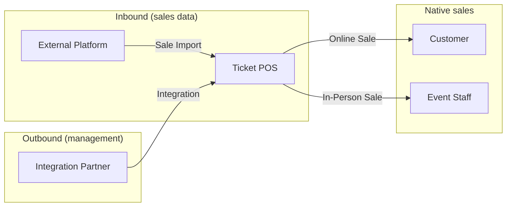

# Business Intent

## Purpose

Ticket POS is an event ticketing point-of-sale platform for organizations that run live events.
It lets them create events, define what tickets are sold, sell tickets online and in person, import sales from external ticketing platforms, and connect third-party systems through programmatic access.

The canonical domain vocabulary lives in [CONTEXT.md](../CONTEXT.md).
This document captures the business intent, scope, and decisions behind that model.

## Problem

Event organizers and venues need a single place to define their ticket catalog and sell across multiple channels.
Sales often happen outside any one system - at the door, on the organization's own storefront, and on external platforms such as Eventbrite.
Staff need to manage catalogs and sell tickets without every operation flowing through a single UI.
Partner systems need to create and manage events on behalf of organizations without manual duplication.

## Goals

- Organizations can create Events and define Ticket Types with name, description, price, and capacity.
- Ticket sales are supported from day one through online and in-person channels.
- Event Staff can manage an event's catalog and complete sales for that event.
- Sales from External Platforms can be imported in bulk and counted against Ticket Type capacity.
- Integration Partners can manage events, catalog, and sales on behalf of an Organization through authorized Integrations.
- The permission model is deliberately simple at launch, with room to introduce finer roles later.

## Out of scope (for now)

- Per-event scoping for Integrations.
- Different permission sets for Org Admin, Event Owner, and Integration Partner.
- Distinguishing "ticket tier" from "ticket type" as separate catalog levels.
- Informational-only sale imports that do not affect capacity.

## Actors

| Actor | Description | Scope (at launch) |
|-------|-------------|-------------------|
| **Organization** | A promoter, venue, or company that owns Events | Owns all Events in the org |
| **Org Admin** | A member with full authority over the Organization's Events | All Events in the org |
| **Event Owner** | A member with full authority over one Event | One Event |
| **Event Staff** | A member delegated catalog and sales access | One Event |
| **Integration Partner** | An external service acting on behalf of an Organization | All Events in the org |
| **Customer** | A person who buys a ticket | Not yet modeled in detail |

### Permission model at launch

Org Admin and Event Owner have equivalent authority within their respective scope.
An Org Admin can do on every org Event what an Event Owner can do on a single Event.
Integration Partners have org-wide access equivalent to an Org Admin.
Event Staff can manage Ticket Types and sell tickets, but only for Events they are assigned to.

### Permission model later

Roles may diverge.
For example, Org Admin might gain billing or member-management capabilities that Event Owner lacks.
Integrations might be scoped to specific Events rather than the whole Organization.
Event Staff might split into catalog-only and sales-only roles.

## Core capabilities

### Event and catalog management

- An Organization creates Events.
- Each Event has one or more Ticket Types.
- A Ticket Type has a name, description, price, and capacity.
- "Ticket tier" and "ticket type" are treated as the same concept; only **Ticket Type** is used.

### Sales

Three ways tickets move and get recorded:

1. **Online Sale** - a customer buys through the online storefront.
2. **In-Person Sale** - Event Staff sells at a physical point of sale.
3. **Sale Import** - Event Staff uploads a batch of sales from an **External Platform** over a given period.

All three count against the Ticket Type's remaining capacity.

### External platform integration (inbound sales data)

Organizations may sell tickets on External Platforms outside this system.
Event Staff can upload those sales remotely so the org has a unified view of what has sold.
Imported sales decrement capacity the same way Online and In-Person sales do.

### Partner integration (outbound management access)

Third parties can connect to the platform and manage Events, Ticket Types, capacity, descriptions, and sales programmatically.
An Organization authorizes an **Integration** for an **Integration Partner**.
At launch, that authorization is org-wide.

This is distinct from External Platforms.
External Platforms are where sales happen elsewhere and get imported in.
Integration Partners are systems that push and pull management operations into this platform.

## Key decisions

| Topic | Decision |
|-------|----------|
| Ticket tier vs ticket type | Same concept; use **Ticket Type** only |
| Ticket Type fields at launch | Name, description, price, capacity |
| Sales at launch | Online and in-person, both required |
| Delegated human role | **Event Staff** (catalog + sales on assigned Events) |
| Org structure | Organizations own Events; members hold roles |
| Org Admin vs Event Owner | Equivalent permissions at launch |
| Integration scope | Org-wide, equivalent to Org Admin at launch |
| Sale Import source | External Platforms only; always counts against capacity |
| API surface | Full management of events, catalog, and sales for Integration Partners |

## Scenarios considered

**Org admin vs event owner.**
A venue Organization runs fifty Events.
An Org Admin can manage all of them.
An Event Owner has the same powers but only on their assigned Event.
At launch there is no capability gap between the two within an Event's scope.

**Door sales.**
Event Staff at a physical point of sale sells walk-up tickets.
These are In-Person Sales recorded in the system and counted against capacity.

**Off-platform sales.**
Tickets sold on Eventbrite over a weekend are uploaded as a Sale Import.
The import covers a date range and ticket types.
Capacity is reduced accordingly.

**Partner-managed events.**
A venue's booking app holds an Integration with the Organization.
It creates Events, defines Ticket Types, and records sales without a human using the web UI.

## Success criteria (directional)

- An Organization can go from zero to selling tickets online and in person in one session.
- Remaining capacity on a Ticket Type is always accurate across native sales and imports.
- An Integration Partner can perform every catalog and sales operation an Org Admin can, without the web UI.
- The domain language in CONTEXT.md is sufficient for engineers and stakeholders to discuss features without ambiguity.

## Related documents

- [CONTEXT.md](../CONTEXT.md) - canonical domain glossary
- [technical-design.md](./technical-design.md) - technology stack, architecture, and API contract
- [roadmap.md](./roadmap.md) - feature-by-feature implementation plan
