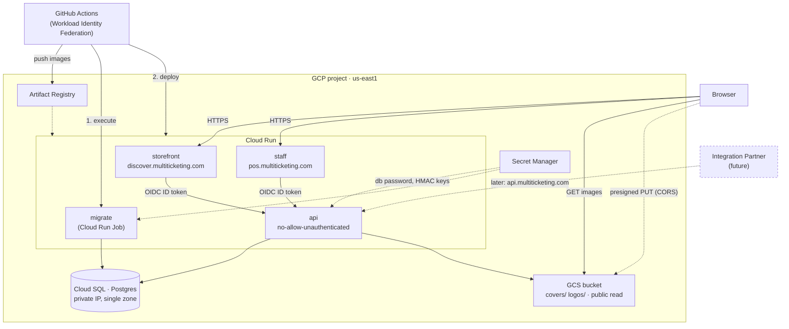

# GCP Deployment Design

How Ticket POS runs on Google Cloud. Domain vocabulary lives in [CONTEXT.md](../CONTEXT.md).

**Status:** implemented — the Terraform under `terraform/` realizes this design; kept as the deployment design record.

## Shape

Three stateless containers on Cloud Run, one managed Postgres, one bucket. Region `us-east1` throughout.



## Decisions

| # | Decision | Why |
|---|---|---|
| 1 | **Cloud Run**, not GKE or VMs | Three stateless HTTP containers; scale-to-zero; no ops floor |
| 2 | **Cloud SQL Postgres 18**, private IP, single zone | Managed backups/PITR; `availability_type = REGIONAL` is a later one-line change |
| 3 | **GCS via S3-compat HMAC**, public-read bucket | Zero application code change; keeps MinIO and GCS on one code path |
| 4 | **Module + `prod` root only** | Staging later is a thin root module, not a refactor |
| 5 | **Migrations as a Cloud Run Job** | `migrate.Up` has no advisory lock — concurrent boot-time migration is unsafe |
| 6 | **GitHub Actions + WIF + Artifact Registry** | Keyless; no long-lived SA key in a third-party system |
| 7 | **Cloud Run domain mappings**, DNS stays at Namecheap | Two static CNAMEs, apex unused, no email to migrate; $0 |
| 8 | **`output: "standalone"`** Next images | ~150MB vs ~1GB; cold start is user-visible on the storefront |
| 9 | **API IAM-locked, invoked with OIDC ID tokens** | Stronger than network isolation, and avoids a ~$35/mo Cloud NAT |

### Why not internal ingress (decision 9)

`*.run.app` resolves to public IPs. Reaching an internal-ingress service requires the caller's egress
routed through the VPC (`ALL_TRAFFIC`), which then requires **Cloud NAT** for all other outbound traffic —
a permanent ~$35+/mo cost, more than the rest of this design combined. Cloud Run IAM rejects
unauthenticated requests before the container is reached, authenticates the *caller* rather than trusting
the network, and costs nothing. The API's own session auth remains in place regardless.

## Required code changes

Deployment reaches into the application in five places. None are large; all are prerequisites.

| Change | Files | Reason |
|---|---|---|
| Build `/migrate` alongside `/server` | `backend/Dockerfile` | Job needs the binary; only `/server` is copied today |
| `output: "standalone"` + `outputFileTracingRoot` | `apps/*/next.config.ts` | Image size / cold start |
| Dockerfile per frontend | `apps/staff/`, `apps/storefront/` | Done — both exist and run in the parity stack |
| Attach OIDC ID token to API calls | `apps/*/lib/api.ts` | Done — see below; skipped locally |
| Bump local Postgres to match prod major | `docker-compose.yml`, CI | Otherwise migrations are validated against a different engine |

### Frontend image pattern

Established by the Storefront (`apps/storefront/Dockerfile`) and reused by Staff.

- **Build context is the repo root.** The apps transpile workspace packages from `packages/`, and the
  pnpm lockfile is workspace-wide.
- **`outputFileTracingRoot` is the workspace root.** pnpm links workspace packages as symlinks, so
  tracing rooted at the app directory silently omits their real files. It builds cleanly and fails at
  container start with `MODULE_NOT_FOUND` — the reason acceptance for these images is "boots and serves",
  not "builds". The tracing root also sets the standalone entrypoint: `apps/<app>/server.js`.
- **`NEXT_PUBLIC_*` are build arguments.** `next build` inlines them into the client bundle; supplying
  them at runtime leaves them empty. Cloud Build must pass them with `--build-arg`, not the Cloud Run
  service. Server-only configuration (`API_URL`) stays a runtime environment variable.

Staff (`apps/staff/Dockerfile`) follows it with two differences worth knowing:

- **No `NEXT_PUBLIC_*` build arguments.** Staff's browser bundle never calls the Go API directly; it calls
  Staff's own route handlers, which hold the httpOnly session cookie and proxy onwards with the server-only
  runtime `API_URL`. There is nothing public to inline.
- **The session cookie is `Secure` in the image**, because `sessionCookieOptions()` keys off
  `NODE_ENV === "production"`. Browsers accept `Secure` cookies from `http://localhost`, so the parity
  stack signs in over plain HTTP; any other plain-HTTP hostname would silently drop the cookie and loop
  the visitor back to `/login`. In production Cloud Run terminates TLS, so the flag is correct as-is.

### Service-to-service ID tokens

Both frontends fetch a Google-signed ID token from the metadata server and attach it to every
server-side API call. It lives in each app's shared fetch layer only — `callBackend`/`fetchBackendRaw`
in Staff, `fetchData` in Storefront — because nothing else in either app addresses the Go API. Four
details are load-bearing:

- **The token goes in `X-Serverless-Authorization`, not `Authorization`.** Cloud Run checks that header
  for IAM when present and strips it before the container sees the request. Staff's `Authorization`
  header already carries the end-user session token, which the Go API reads; displacing it would leave
  IAM satisfied and every authenticated endpoint returning 401.
- **The platform is detected from `K_SERVICE`, not by probing the metadata address.** Off-platform there
  is no listener on `169.254.169.254`/`metadata.google.internal`, and a fetch at it can stall rather than
  refuse. Absent `K_SERVICE`, no network call is made at all — the local and parity stacks pay nothing.
- **Failure throws.** A `ServiceAuthError` beats an unauthenticated call that Cloud Run bounces with a
  bare 403, which reads like an application bug. In Storefront the token is acquired outside the
  `try/catch` that degrades API failures to an empty page, so this one failure is not swallowed.
- **The audience is the API's own Cloud Run URL** (`API_URL`), and the token is cached until a minute
  before its `exp`.

Verified locally only in the negative: `make prod` + `make test-parity` exercise the skip path. The
production path is confirmed by hand at first deploy — see
[manual-verification-oidc.md](manual-verification-oidc.md).

## Bucket CORS

`ObjectStorage.PresignPut` means the **browser** uploads directly to the bucket
(`event-cover-image.tsx:74`, `org-logo-image.tsx:86`). MinIO is permissive by default, so this works
locally and fails in production with an opaque browser error unless the bucket has a `cors` block
allowing `PUT` from `https://pos.multiticketing.com`.

## PayPhone go-live checklist

Online Sales charge through the platform's single PayPhone merchant account (ADR 0012). The API
selects the real provider purely on the presence of `PAYPHONE_API_TOKEN` **and** `PAYPHONE_STORE_ID`;
with either absent it runs the **stub** Payment Provider. Locally that is the point — checkout works
with zero setup — but in production it is never acceptable for real sales: the Storefront's stub
payment page is a 404 on a production build, so an unconfigured production checkout is a dead end,
not a fake sale. Work the list in order; the domain steps have external latency.

1. **Create the PayPhone account.** Register a PayPhone Business account and open the Developer
   portal ([docs.payphone.app](https://docs.payphone.app/boton-de-pago)). Create an application for
   the payment button ("Botón de pago"); this is what issues the credential pair.
2. **Register the production Storefront domain.** The payment button is **domain-bound**: it only
   works from the domain registered in the developer portal, over **HTTPS**. Register
   `discover.multiticketing.com` (the `storefront_domain` in `terraform/envs/prod`). The response
   URL the API sends is `https://<storefront_domain>/checkout/return` — it must be publicly
   reachable, because PayPhone's return redirect (carrying `id` and `clientTransactionId`) is the
   **only** confirm trigger; there are no webhooks.
3. **Obtain the credentials.** The portal issues a Bearer **token** and a **storeId** per
   application. Sandbox and production are different pairs:
   - **Sandbox** credentials auto-approve — no money moves. Use them only in the dev stack for the
     pre-go-live pass ([manual-verification-payphone.md](manual-verification-payphone.md)).
   - **Production** credentials move real money and are the only pair that may reach Secret Manager.
4. **Wire the secrets through Terraform.** Put the production pair in the gitignored `.env` as
   `TF_VAR_payphone_api_token` and `TF_VAR_payphone_store_id`, then
   `set -a; source .env; set +a` and `terraform -chdir=terraform/envs/prod apply`. The apply writes
   both to Secret Manager and mounts them on the API service (`payphone.tf` in the module); no
   value ever appears in a Cloud Run env var in plaintext. The same trap as the Resend key (#73)
   applies: an apply without the `.env` sourced **removes** the secret versions and silently drops
   production back to the stub.
5. **Do not set `PAYPHONE_API_BASE_URL` anywhere in production.** It exists so the integration
   suite can point Prepare/Confirm at a fake PayPhone server, and the API **refuses to start** in
   production with it set — anyone able to point it elsewhere could "approve" payments no one ever
   made. There is deliberately no Terraform variable for it.
6. **Confirm `STOREFRONT_STUB_PAYMENTS` is nowhere in production.** It is the parity stack's
   explicit opt-in that resurrects the stub interstitial on a production build
   (`docker-compose.prod.yml`); no Terraform resource sets it, and none may.
7. **Know the reversal behavior before the first sale.** PayPhone auto-reverses any charge not
   confirmed within **5 minutes** of payment; the payment form URL itself expires after 10. A
   customer who pays but never lands back on `/checkout/return` (closed tab, dead connection) is
   automatically refunded and the sale is lost — money-safe by design, no reconciler in v1
   (ADR 0012). Refunds of completed sales are **manual** on the PayPhone dashboard; every Payment
   records the provider transaction id for cross-referencing.
8. **Run the sandbox verification pass** ([manual-verification-payphone.md](manual-verification-payphone.md))
   before switching the production credentials in, and one small real-card purchase (then a manual
   dashboard refund) after.

## Future: Integration Partner API

Routes are already path-namespaced (`/api/v1/public/*`, `/api/v1/auth/*`, `/api/v1/staff/*`);
no `/api/v1/integration/*` routes exist yet.

Cloud Run IAM is per-service, not per-path, and a load balancer cannot mint ID tokens — so a service
cannot be both IAM-locked for the frontends and publicly reachable for partners. When partner endpoints
land, deploy a **second Cloud Run service from the same image**: `api-public`, unauthenticated, behind an
external HTTPS load balancer at `api.multiticketing.com` with Cloud Armor rate limiting. This is where the
~$18/mo load balancer finally earns its cost. It needs a route-profile env var so the public service
mounts only partner routes.

## Deliberately out of scope

- **Regional HA** — single zone until real money flows through the system
- **Private bucket / signed downloads** — nothing is persisted privately today; sale import files are parsed in memory
- **Cloud CDN + Cloud Armor** — arrive with the partner API load balancer
- **Real email provider** — `EmailSender` has only a logging implementation; OTPs will not be delivered in production until this is solved
- **Staging environment** — module is written to make it cheap to add

## Rough monthly cost

| Item | Est. |
|---|---|
| Cloud SQL `db-g1-small`, single zone | ~$25 |
| Cloud Run (scale to zero, low traffic) | ~$0–5 |
| Artifact Registry + GCS | ~$1–3 |
| Secret Manager, domain mappings, DNS | ~$0 |
| **Total** | **~$30–35** |

## Project

GCP project **`multiticketing`** (number 706310105744), billing enabled. Required APIs are enabled:
`sqladmin`, `run`, `artifactregistry`, `secretmanager`, `compute`, `servicenetworking`,
`iamcredentials`, `sts`, `cloudresourcemanager`, `storage`.

GitHub repository `redplanettribe/ticket_pos` — this is the repository the Workload Identity Federation
attribute condition must be scoped to.

## Open items

1. ~~Postgres version~~ — **`POSTGRES_18`**, the newest major Cloud SQL offers. Confirm it is creatable in
   `us-east1` at apply time; the enum is reported client-side by gcloud.
2. ~~Domain-mapping support in `us-east1`~~ — confirmed supported.
3. `terraform` is not installed locally.
4. ~~Frontends attaching ID tokens to API calls~~ — landed in `apps/*/lib/api.ts`. The production half is
   unverifiable locally; confirm it at first deploy with
   [manual-verification-oidc.md](manual-verification-oidc.md).
5. **OTP email delivery blocks real production use** (see out of scope). `EmailSender` has only a logging
   implementation, so staff cannot sign in to a deployed environment. Deployed and usable are different
   milestones; this decision is not yet made.

## Layout

```
terraform/
├── bootstrap/            # state bucket (chicken-and-egg, run once)
├── modules/ticket-pos/
└── envs/prod/
```
