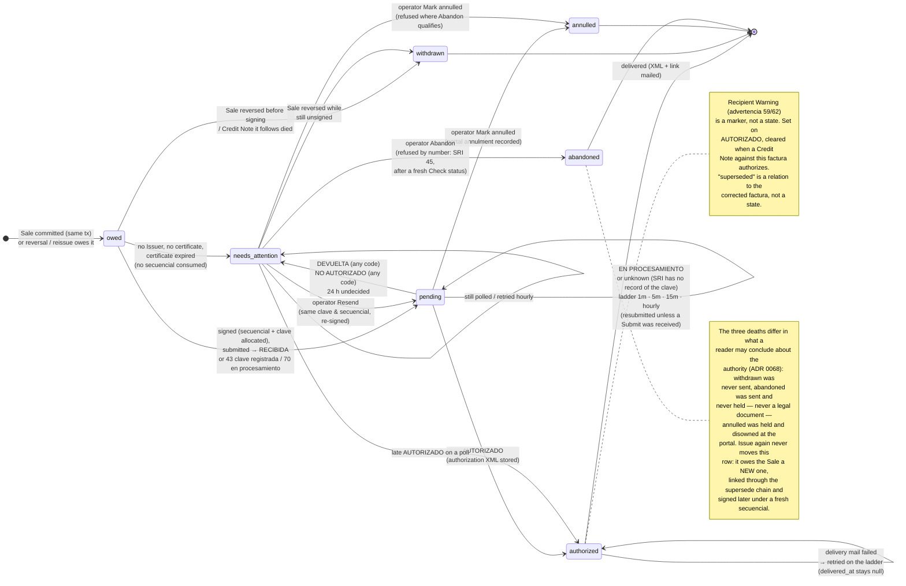
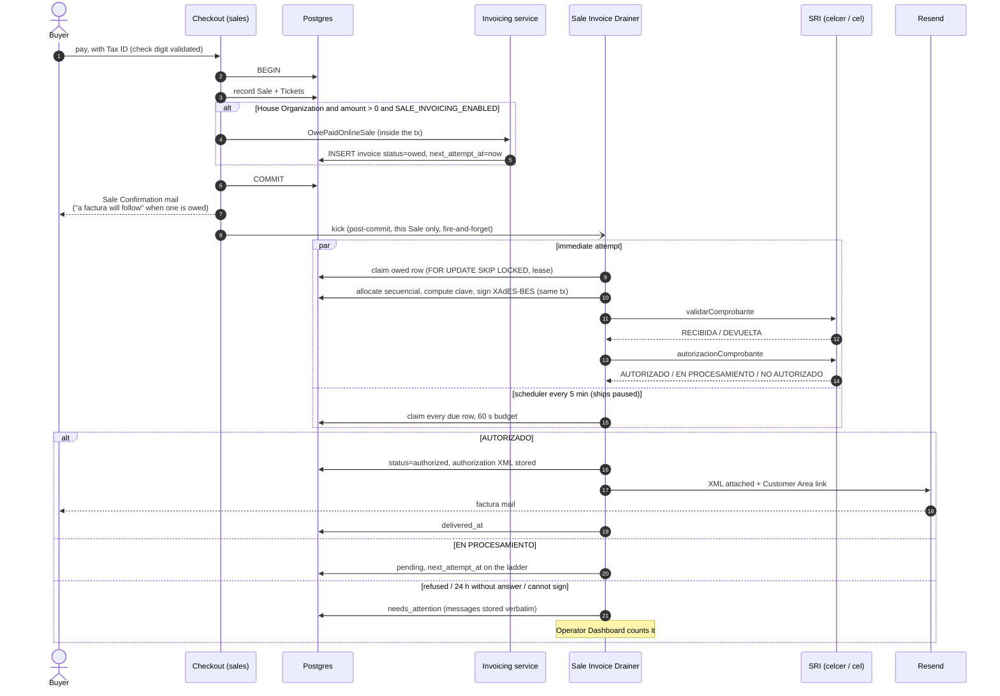
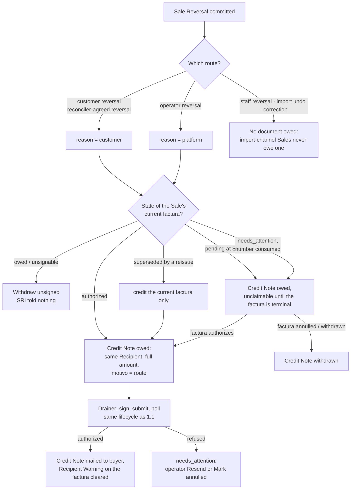
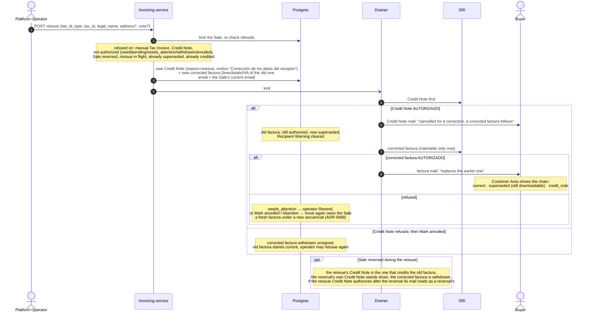
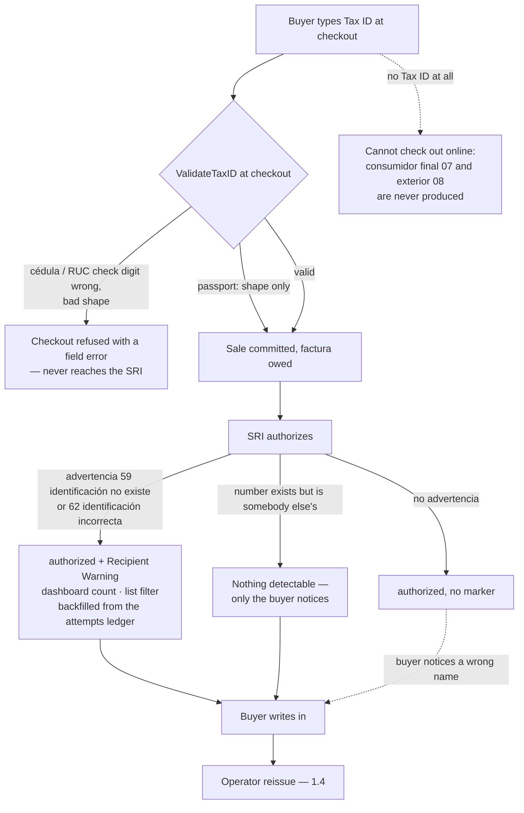
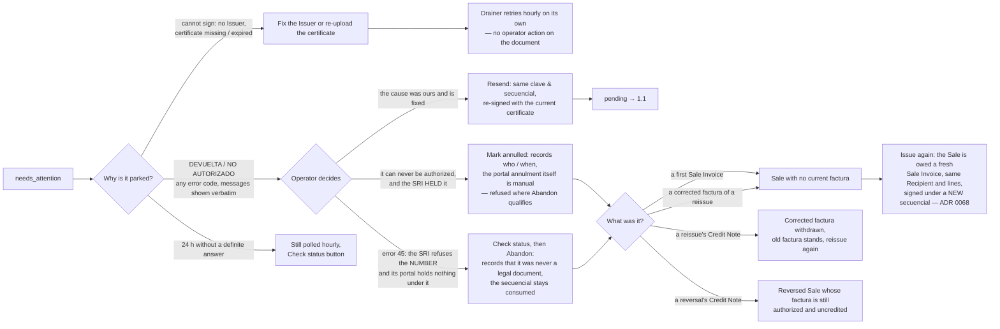

# SRI invoicing: every way a facturación can go, and what the platform does about it

Date: 2026-08-27, re-audited 2026-09-01. Audited against `main` at `6ea4255` (#575's arc built: Abandon and
Issue again, ADR 0068).

This is the "what we built, and what we didn't" companion to
`docs/research-sri-facturacion-electronica.md` (what the SRI requires) and to
ADRs [0059](./adr/0059-the-platform-is-the-sole-issuer-and-its-signing-certificate-lives-encrypted-in-the-database.md),
[0060](./adr/0060-a-house-organizations-tickets-are-the-platforms-sale-invoiced-after-checkout-and-credited-on-reversal.md),
[0061](./adr/0061-a-wrong-recipient-is-corrected-by-reissue-a-credit-note-then-a-fresh-sale-invoice-never-an-edit.md)
and [0068](./adr/0068-a-number-the-authority-never-held-is-abandoned-not-annulled-and-its-sale-is-issued-again.md)
(what we decided). Paths are relative to the repository root; `B/` is `backend/internal/`.

## Status legend

| Label | Meaning |
|---|---|
| **Built** | Code found; the cited `file:line` is the proof. |
| **Partial** | The path exists but a branch of the flow is not handled; the note says which. |
| **Ruled out** | Deliberately not built; the ADR or issue that ruled is cited. |
| **Tracked** | Known gap with an issue number. |
| **Untracked** | Gap with neither a ruling nor an issue. Collected at the end. |

Vocabulary: *Sale Invoice* = the factura (codDoc `01`) a paid Online Sale of a House Event owes; *Credit Note* = nota de
crédito (`04`); *Drainer* = the Sale Invoice Drainer (internal endpoint + scheduler); *needs_attention* = a document the
Drainer could not settle, waiting for a Platform Operator — the needs-attention *queue* is wider than the status, see
row 57; *Recipient Warning* = SRI advertencia 59/62 on an authorized document.

---

## 1. Diagrams

### 1.1 Document lifecycle (one Sale Invoice or Credit Note row)

Transport errors, HTTP 5xx and SOAP faults never change the status: an attempt row is written and the document is
rescheduled on the ladder. A document the SRI never acknowledged is resubmitted with the same bytes, clave and
secuencial; one it acknowledged is only polled.

**Only a received Submit counts as acknowledgement; a query answer never does** (maintainer ruling 2026-08-29, #513).
The SRI has taken delivery of a document when a `validarComprobante` call came back RECIBIDA, or DEVUELTA with 43
(clave registrada) / 70 (en procesamiento), which mean the same thing. An `autorizacionComprobante` answer never
acknowledges anything, whatever it says: EN PROCESAMIENTO is the SRI describing a document it is processing, and
`unknown` — `numeroComprobantes` 0, an empty `autorizaciones` list — is the SRI saying it has no record of the clave
at all. So the ledger shape [Submit error, Query received] and the shape [Submit error, Query unknown] are both
resubmitted, and [Submit received, Query unknown] is only polled. Resubmitting cannot duplicate: a document the SRI
does hold answers 43/70, which is itself an acknowledging Submit. `unknown` decides nothing about the status — the
document stays `pending`, or `needs_attention` past 24 h, and stays on the ladder — and it never counts as
acknowledgement.

### 1.2 Checkout → Sale Invoice → buyer

### 1.3 Reversal → Credit Note

A Sale Reversal is never refused or delayed by the state of its paperwork. A refused Reversal Request reverses nothing,
so it owes nothing.

### 1.4 Reissue (wrong Recipient, ADR 0061)

### 1.5 Tax ID quality: what the buyer typed, and what can be done about it

### 1.6 Operator exits from `needs_attention`

---

## 2. Flow table

### 2.1 What owes a document

| # | Flow | Status | Proof | Note |
|---|---|---|---|---|
| 1 | Paid Online Sale of a House Event → Sale Invoice owed in the Sale's own transaction, immediate attempt after commit | **Built** | `B/sales/repository/payments.go:660` → `B/invoicing/service/saleinvoice.go:37` `OwePaidOnlineSale`; kick `B/sales/service/service.go:642` | Row is `owed` with `next_attempt_at = now`; the kick drains that Sale only. |
| 2 | Sale of a non-House Organization | **Ruled out** (ADR 0060) | `B/sales/repository/payments.go:697` `isHouseOrganization` | Designating an Organization House later affects future Sales only; a past sale is invoiced only by an operator's Sale Invoice Backfill (ADR 0064). |
| 3 | Free / zero-total Sale (ADR 0017) | **Ruled out** (ADR 0060) | `payments.go:660` (`AmountCents > 0`) | Whether the SRI accepts a USD 0 factura is unverified. |
| 4 | Manually Recorded Sale / Sale Import (ADR 0050/0052) | **Ruled out** (ADR 0060, "deliberate and visible") | `B/sales/service/service.go:617` | The seam is only wired on online approval. A row without a Tax ID would have to be consumidor final — irreversible. |
| 5 | `SALE_INVOICING_ENABLED` closed | **Built** | `B/server/app.go:576`; `B/invoicing/service/drainer.go:196` | Seam not tied → no owed rows at all; drain endpoint answers `SALE_INVOICING_UNAVAILABLE`. Rows owed before a close simply wait. |
| 6 | Issuer missing, certificate missing or expired at signing time | **Built** | `B/invoicing/service/drainer.go:586` `signOwedInvoice` | Parked `needs_attention` with a platform-typed message; **no secuencial, no SRI call, no attempt row**; retried hourly without operator action. |
| 7 | Process dies between the Sale's commit and the immediate attempt | **Built** | `B/invoicing/repository/drainer.go:69` `ClaimDueInvoice` + scheduler | The row was already due at owe-time; the next tick claims it. |
| 8 | Two Sale Invoices minted for one Ticket Sale | **Partial** | `backend/migrations/098_sale_invoices.sql:87-100` (index is non-unique) | Prevented by control flow (one call site inside the Sale's tx), not by the schema. Only `102_sale_invoice_reissue.sql:44` enforces one live successor per factura. → Untracked U3 |

### 2.2 The Recipient's Tax ID

| # | Flow | Status | Proof | Note |
|---|---|---|---|---|
| 9 | Tax ID type → SRI code: cédula 05, RUC 04, passport 06 | **Built** | `B/invoicing/sri/factura.go:63-65` | |
| 10 | Consumidor final (07) or identificación del exterior (08) | **Ruled out** (ADR 0060: a consumidor-final factura can never be credited) | same | Checkout requires a Tax ID, so a buyer without one cannot buy online (`B/sales/handler/checkout.go:290`). |
| 11 | Cédula / RUC with a wrong check digit | **Built** | `B/sales/handler/checkout.go:300` → `B/platform/taxid.go:242` | Refused at checkout with a field error; never reaches the SRI. Passport is shape-only. |
| 12 | SRI advertencia 59 (no existe) / 62 (incorrecta) on an authorized document → Recipient Warning | **Built** | derive `B/invoicing/service/invoice.go:421`; `B/invoicing/recipient_warning.go:32`; backfill `backend/migrations/101_recipient_warning.sql:45`; clear `B/invoicing/repository/invoice.go:313` | Status stays `authorized`. Cleared when an authorized Credit Note lands against the factura (reissue's or reversal's). Older documents were backfilled from the attempts ledger. |
| 13 | Comments say the warning clears "only when superseded"; code clears on credit | **Untracked** (stale comments, code matches ADR 0061 as reviewed) | `B/invoicing/recipient_warning.go:9-10`, `101_recipient_warning.sql:19-22`, OpenAPI text `B/invoicing/handler/invoice.go:159` | → U1 |
| 14 | Valid Tax ID that belongs to somebody else | **Ruled out** as undetectable (ADR 0061) | — | Only the buyer notices; the cure is a reissue. SRI lookup at checkout was refused (no official service, rate-limited, couples checkout to the SRI). |
| 15 | Wrong Recipient on an authorized factura → operator reissue | **Built** | see 2.5 | |
| 16 | Sale Re-addressing (ADR 0058) after the factura exists | **Partial** | frozen Recipient `B/invoicing/service/saleinvoice.go:253`; delivery `B/invoicing/service/delivery.go:72`; reissue reads the live email `B/invoicing/repository/reissue.go:73` | The Recipient snapshot is unchanged (correct: re-addressing moves the addressee, not what was transacted). But the **delivery mail goes to the email frozen on the invoice**, so a factura authorized after a re-addressing is mailed to the stranded address — while a reissue's corrected factura takes the Sale's current email. → U2 |

### 2.3 What the SRI answers

| # | Flow | Status | Proof | Note |
|---|---|---|---|---|
| 17 | RECIBIDA → AUTORIZADO → delivered | **Built** | `B/invoicing/sri/authority.go:56` `Submit`, `:90` `QueryOutcome`; `B/invoicing/service/drainer.go:387` | Delivery happens in the same round under the same lease. |
| 18 | EN PROCESAMIENTO, repeatedly | **Built** | `drainer.go:116` `SaleInvoiceLadder`, `:120` `SaleInvoiceAttentionAfter`, `:790` `undecidedStatus` | 1 m · 5 m · 15 m · hourly from `issued_at`; at 24 h undecided → `needs_attention` **and still worked hourly**. A query answer is not an acknowledgement, so whether the round polls or resubmits is decided from the Submit attempts alone (row 21a). |
| 19 | Error 43, clave already registered (we sent it, lost the answer) | **Built** | `B/invoicing/sri/authority.go:67` (`AlreadyHeld`) | A received Submit: the SRI holds it, so it is polled and never sent again. |
| 20 | Error 70, clave en procesamiento | **Built** | `B/invoicing/sri/client.go:90`; `B/invoicing/invoice.go:333` `AcknowledgedByAuthority`, called at `drainer.go:367` | Same: poll, never resubmit. |
| 21 | Transport error, HTTP 5xx, SOAP fault, timeout | **Built** | `B/invoicing/service/invoice.go:359` `attempt`; `drainer.go:375`, `:579` `reschedule` | Attempt row written, status untouched, rescheduled on the ladder; a document no Submit ever landed is sent again with the same bytes, clave and secuencial. |
| 21a | Autorización reports nothing under the clave (`numeroComprobantes` 0) — what a Submit lost in transport leaves behind | **Built** (#513 → #514, #515) | `B/invoicing/sri/authority.go:97` `OutcomeUnknown`; `B/invoicing/invoice.go:333` `AcknowledgedByAuthority`; `drainer.go:367`, `:563` | Its own outcome, `unknown`, on the ledger and in the OpenAPI enum. It decides nothing — `pending`, or `needs_attention` past 24 h, and still on the ladder — and **never counts as acknowledgement**: only a received Submit does. So [Submit error, Query unknown] and [Submit error, Query received] are both resubmitted, and [Submit received, Query unknown] is only polled. |
| 22 | Error 50, "error interno general" (SRI-side, transient) | **Partial** | only 43, 70, 60 are named constants (`sri/client.go:88-92`) | Arrives as an ordinary DEVUELTA → `needs_attention`, not retried automatically. → U4 |
| 23 | DEVUELTA on schema (35/36/47/48/49) | **Partial** | `B/invoicing/service/invoice.go:423` `applyOutcome` | → `needs_attention`, messages verbatim. Correct outcome; not distinguished by code. |
| 24 | NO AUTORIZADO on signature / certificate (39/40) | **Partial** | same | Same bucket. The operator fixes the certificate and Resends. |
| 25 | NO AUTORIZADO emisor-side (37/46/56/57/63: RUC sin autorización, no existe, establecimiento cerrado, suspendida, clausurado) | **Partial** | same | Same bucket; not fixable by resend, but nothing says so. |
| 26 | Arithmetic 52, clave mismatch 58, extemporánea 65, fecha inválida 67 | **Partial** | same | Same bucket. |
| 27 | Error 45, secuencial registrado | **Built** (ADR 0068, #576–#580) | schema `backend/migrations/096_invoicing_invoices.sql:105-120` UNIQUE on (issuer, env, cod_doc, estab, pto_emi, secuencial); detection `B/invoicing/number_refusal.go:40` `RefusedByNumberIn`; Abandon `B/invoicing/service/abandon.go:97`; Issue again `B/invoicing/service/issueagain.go:82` | Prevented structurally against ourselves; when the SRI returns it anyway — production's 001-001-000000025 and 26, refused on Submit and again on a Resend, with the portal showing neither number — the remedy is two operator acts: **Abandon** the document, then **Issue again**, which owes the Sale a fresh Sale Invoice the Drainer signs under a freshly allocated secuencial. The abandoned number stays consumed; the sequence only moves forward. Detail in rows 30a and 30b. |
| 28 | Every definite refusal is one `needs_attention` bucket | **Untracked** (by design so far; never ruled in an ADR) | `invoice.go:423` | Messages are stored verbatim on the row and in the ledger, so a per-code taxonomy could be added without re-fetching. → U4 |
| 29 | Operator Resend from `needs_attention` | **Built** | `B/invoicing/service/invoice_actions.go:80` `ResendInvoice`, `:231` `rebuildAndSign`; refusal `:203` `resendRefusal` | Same clave and secuencial, re-signed with the current certificate and refreshed Issuer details; on `AlreadyHeld` the stored bytes are kept. Refused with `INVOICE_REFUSED_BY_NUMBER` on a document the SRI refuses by number (#577): the same secuencial can only earn error 45 again. Check status stays available there, deliberately — Abandon requires a fresh one. |
| 30 | Operator Mark annulled | **Built** | `B/invoicing/service/attention.go` `AnnulInvoice`; `backend/migrations/099_invoice_annulment.sql`; narrowing `attention.go` `annullable` | From `pending` or `needs_attention`, signed documents only; records who/when; irreversible; the portal annulment itself is a manual act. Narrowed by #578: where Abandon qualifies it answers `INVOICE_ABANDON_INSTEAD`. Mark annulled is for a document the authority **held** and the operator disowned by hand — never for one the portal has no record of. |
| 30a | Operator Abandon: the authority refuses the number and never took the document | **Built** (ADR 0068, #578) | `B/invoicing/service/abandon.go:97` `AbandonInvoice`, freshness rule `:87` `AbandonCheckFreshness`; `B/invoicing/handler/abandon.go:44`; route `B/server/routes.go:457`; `backend/migrations/119_invoice_abandonment.sql`; staff `apps/staff/app/operator/invoicing/[id]/operator-invoice-actions.tsx:168` | Ninth status `abandoned`, terminal: sent, never held, never a legal document, so nothing is owed at the portal and nothing is ever declared for it. Offered on any kind, from `needs_attention`, `rejected` and `not_authorized`, gated on the refusal by number alone and on a **fresh Check status**: the last ledger attempt must be a query the authority answered, started within 15 minutes. Trail `abandoned_by` / `abandoned_at` / `abandon_note`; number, clave, bytes and attempts kept forever; `next_attempt_at` cleared. Codes `INVOICE_ABANDONED`, `INVOICE_NOT_ABANDONABLE`, `INVOICE_NOT_REFUSED_BY_NUMBER`, `INVOICE_CHECK_NOT_FRESH`, `INVOICE_ABANDON_INSTEAD` (`B/invoicing/errors.go:142`, `:153`, `:163`, `:173`, `:186`). |
| 30b | Operator Issue again: a Sale whose factura is terminally dead is owed a fresh one | **Built** (ADR 0068, #579, #580) | `B/invoicing/service/issueagain.go:82` `IssueSaleInvoiceAgain`, gate `:131` `issuableAgainDocument`, copy `:200` `replacementSaleInvoiceOf`; `B/invoicing/handler/issueagain.go:44`; route `B/server/routes.go:469`; `backend/migrations/120_live_successor_terminal_dead.sql`; staff `apps/staff/app/operator/invoicing/[id]/operator-invoice-issue-again.tsx` | From `abandoned` or `annulled` only — `withdrawn` is deliberately not a way in, since neither a reversed Sale nor a dead Credit Note's follower is owed a factura. Not a signing route: an ordinary `owed` row with no number, clave or signature, drained on a later round under a fresh secuencial. No Credit Note is owed — nothing to cancel — and the replacement carries the dead document's Recipient, lines and amounts **verbatim**: it corrects nothing (that is the reissue's business, row 42). Linked through ADR 0061's supersede chain, over any number of hops. Migration 120 widened the one-live-successor index to exclude `withdrawn`, `annulled` and `abandoned`, so a dead successor no longer blocks its Sale. Refusals `INVOICE_MANUAL_NOT_ISSUABLE_AGAIN`, `CREDIT_NOTE_NOT_ISSUABLE_AGAIN`, `INVOICE_NOT_TERMINALLY_DEAD`, `INVOICE_ALREADY_REPLACED`, and `INVOICE_SALE_REVERSED` reused. The Drainer's Credit-Note wait is skipped for a replacement by asking whether the document it supersedes is terminally dead (`B/invoicing/invoice.go:90` `TerminallyDead`, read at `drainer.go:492`). |
| 31 | Reconciliation via `consultarEstadoAutorizacionComprobante` | **Untracked** (proposed in the research doc §3.3 rule 10, never ruled) | `B/invoicing/sri/client.go:231` uses `autorizacionComprobante` only | The ladder poll plus the operator's Check status is the only reconciliation. → U5 |
| 32 | Sequence numbering per (issuer, environment, cod_doc, estab, pto_emi) | **Built** | `B/invoicing/repository/invoice.go:130` `allocateSecuencial` | Allocated inside the signing tx; rollback leaves no hole; unsignable documents park before allocation. |
| 33 | Ambiente pruebas vs producción | **Built** | `B/invoicing/sri/client.go:19-20` (celcer / cel); `sri/authority.go:41` `AmbienteFor` | Environment is a column on the Issuer, copied at signing time. |
| 34 | Attempts ledger, one row per SRI request | **Built** | `B/invoicing/repository/invoice.go:327` `RecordAttempt` | Outcome, verbatim messages, error text, duration. |

### 2.4 Reversal

| # | Flow | Status | Proof | Note |
|---|---|---|---|---|
| 35 | Reversal while the factura is unsigned (owed, or parked unsignable) | **Built** | `B/invoicing/service/saleinvoice.go:188`, `:234` `withdrawNeverSent` | Withdrawn in the reversal's tx; SRI told nothing. |
| 36 | Reversal while the factura is pending at the SRI | **Built** | `saleinvoice.go:222`; `B/invoicing/repository/drainer.go:81-90` | Credit Note owed but unclaimable until the factura is terminal. |
| 37 | Reversal of an authorized factura | **Built** | `saleinvoice.go:253` `creditNoteOf`; motivo `B/invoicing/invoice.go` `CreditNoteMotivo` | Same Recipient, lines and totals; full amount; route as reason and motivo. |
| 38 | Reversal while the factura is `needs_attention` with a number consumed | **Built** | `saleinvoice.go:195` | Credit Note waits; if the factura later dies (annulled) the Credit Note is withdrawn (`drainer.go:378`). Waits indefinitely otherwise. |
| 39 | The Credit Note itself is refused | **Partial** | `invoice.go:423` | `needs_attention` for the operator; if annulled, the reversed Sale keeps an authorized, uncredited factura with no automatic follow-up. → U6 |
| 40 | Routes that produce a Credit Note | **Built** for customer + reconciler-agreed (`customer`) and operator (`platform`) | `B/sales/service/reversal.go:967`, `B/sales/service/operator.go:529` | Staff reversal, import undo and correction pass no seam — correct, import-channel Sales never owe a document. A refused Reversal Request reverses nothing. |
| 41 | Reversal during a reissue | **Built** | see 2.5 #47 | |

### 2.5 Reissue (ADR 0061) and Issue again (ADR 0068)

| # | Flow | Status | Proof | Note |
|---|---|---|---|---|
| 42 | Operator reissue: Credit Note (reason `reissue`) + corrected factura owed in one transaction; corrected signed only once the Credit Note is authorized | **Built** | `B/invoicing/handler/reissue.go:56`; `B/invoicing/service/reissue.go:41`; `B/invoicing/repository/reissue.go:53`; gate `B/invoicing/repository/drainer.go:91-95` | Decided under the Sale's lock; Tax ID validated exactly as at checkout; corrected factura's email is the Sale's current one. |
| 43 | Credit Note refused, then Mark annulled | **Built** | `B/invoicing/service/attention.go:129`; `drainer.go:435` `withdrawCorrectedFacturaOfADeadCreditNote` | Corrected factura withdrawn unsigned; old factura stands current; operator may reissue again. |
| 44 | Corrected factura refused | **Built** (bucket) | `invoice.go:423` | `needs_attention`; Resend or Mark annulled. |
| 45 | Corrected factura annulled → Sale with no current factura | **Built** (ADR 0068, #580; #480 closed) | `B/invoicing/service/issueagain.go:82`; index `backend/migrations/120_live_successor_terminal_dead.sql` | Was the dead end #480 recorded, shared with an annulled first factura (#477). Issue again (row 30b) owes the Sale a fresh Sale Invoice, and migration 120 stopped the dead successor holding the chain's one live slot. |
| 46 | Reissue refused on: manual Tax Invoice, Credit Note, not-authorized document, reversed Sale, reissue in flight, superseded, already credited | **Built** | `B/invoicing/service/reissue.go:358`, `:380` `reissueRefusal`; codes in `B/invoicing/errors.go:160-167` | Each its own 409 code. |
| 47 | Sale Reversal during a reissue | **Built** | `saleinvoice.go:141-161`, `:199-222`; `drainer.go:405` `withdrawRedundantCreditNote`; `delivery.go:67` | Exactly one Credit Note reaches the SRI; the corrected factura is withdrawn; a reissue Credit Note that authorizes after the reversal is mailed with reversal wording (#484). |
| 48 | Second reissue on the corrected factura (chain) | **Built** | `B/invoicing/service/attention.go:269` `chainOrder`; `ErrReissueInFlight` `reissue.go:387` | Unbounded chain; one reissue per Sale at a time. |
| 49 | Recipient Warning cleared by the reissue | **Built** | `B/invoicing/repository/invoice.go:313` | Cleared when the reissue's Credit Note authorizes — before the corrected factura is even signed. See #13. |

### 2.6 Delivery and surfaces

| # | Flow | Status | Proof | Note |
|---|---|---|---|---|
| 50 | Delivery mail after authorization: signed XML attached, Customer Area link | **Built** | `B/invoicing/service/delivery.go:79`, `:87` | |
| 51 | RIDE (PDF) attached or generated for the buyer | **Untracked** (the SRI FAQ obliges XML + RIDE, S6 Q21) | `B/invoicing/sri/doc.go:21` names it as future; only a printable staff page exists (`apps/staff/app/operator/invoicing/[id]/ride/`) | → U7 |
| 52 | Delivery fails (Resend down, 429) | **Built** | `delivery.go:90-97`; claim `authorized AND delivered_at IS NULL` `B/invoicing/repository/drainer.go:80` | Authorization untouched; retried on the ladder; `MarkDelivered` is the never-twice guard. No 429-specific pacing. |
| 53 | Sale Confirmation of a House sale says a factura will follow | **Built** | `B/platform/email_content.go:524` | Only when a document was actually owed. |
| 54 | Credit Note mail copy: reversal vs reissue; corrected factura says it replaces | **Built** | `email_content.go:1885`, `:1898`, `:1910`, applied `:1938` | |
| 55 | Customer Area shows the chain: current · superseded (still downloadable, labelled) · credit_note; "on its way" before authorization | **Built** | `B/invoicing/service/customer_documents.go:53-113`; `apps/storefront/components/sale-documents.tsx` | Nothing the SRI said travels to the buyer. |
| 56 | Buyer told when a document's state changes (Res. 25-14: annulment must be communicated) | **Partial** | credit/reissue mails exist; no mail on Mark annulled | An annulled factura produces no buyer mail. → U8 |
| 57 | Operator list: kind filter, `recipient_warning` filter, superseded marker, chain on the Sale lookup; dashboard counts (`needs_attention`, Recipient Warnings) | **Built** | `B/invoicing/handler/invoice.go:176-183`; `B/invoicing/service/attention.go:69`, `:219`; `apps/staff/app/operator/invoicing/operator-invoices-client.tsx:84-91`; `operator-dashboard-client.tsx:182,277` | The invoice detail also carries `refused_by_number`, derived from the stored authority messages rather than a column (`B/invoicing/service/invoice.go` `invoiceDetailView`), so the page says the authority refuses this number instead of showing generic refusal copy. The needs-attention queue and its badge are **not** a status equality: ADR 0068 widens them to documents parked `needs_attention` **or** abandoned with the Sale still standing and no live replacement, so that abandoning a document does not hide the Sale it left uninvoiced; the entry clears itself when Issue again owes one. Built as #581 — do not "simplify" the union back to `status = 'needs_attention'`. |

### 2.7 Ops and legal edges

| # | Flow | Status | Proof | Note |
|---|---|---|---|---|
| 58 | Drainer scheduler job | **Built**, ships paused | `terraform/modules/ticket-pos/sale_invoice_drainer.tf:58,72,112`; `variables.tf:484-501` | `*/5 * * * *` America/Guayaquil; 60 s budget < 120 s attempt deadline < 300 s, asserted by a test. Distinct from `SALE_INVOICING_ENABLED`. |
| 59 | Certificate expiry | **Built** (ADR 0063, #490) | Derivation `B/invoicing/certificate_expiry.go`; Issuer read carries `certificate_expiry`; the Drainer's tick works the 30/7/1/0 ladder above the flag (`B/invoicing/service/certificate_expiry_warning.go`, called first in `drainer.go` `DrainSaleInvoices`); ledger `backend/migrations/103_certificate_expiry_notices.sql`; mail `B/platform/email.go` `CertificateExpiryWarning`; expired → park with the date (`drainer.go` `certificateExpiredMessage`) | One mail per rung per certificate to the operator allowlist in each Staff Locale, highest-unfired-only, restarting on a new fingerprint; banners on the dashboard, the invoicing list and the Issuer page (#504). Alive while `SALE_INVOICING_ENABLED` is closed, but only while the Drainer's scheduler job (row 58) is unpaused. Rotation = re-upload. |
| 60 | Seven-year retention of signed XML + authorization XML | **Built** | `backend/migrations/098_sale_invoices.sql` columns; no DELETE anywhere in `B/` | Deliberate. |
| 61 | Customer erasure request touching invoice rows | **Ruled out** for now (ADR 0060 Consequences; deletion requests go to counsel) | — | No path exists; nothing can delete an issued document. |
| 62 | IVA: fixed 15% inside the price | **Built** | `B/invoicing/invoice.go` `SaleInvoiceIVARate = IVARate15`; `sri.BackOutIVA` | 0% RUAC (artistic events ≤ 2,000 capacity) explicitly out of scope; manual Tax Invoices may still pick 0/exento/no objeto. |
| 63 | formaPago | **Built** | `B/invoicing/service/saleinvoice.go` `saleInvoiceOf` | A Sale Invoice always states 20, whatever the Payment Provider or instrument; documents owed before this change keep the 19 they were written with, and a Reissue or Issue again copies its predecessor's code. |
| 64 | Anexo 26 "RUC Proveedor" campoAdicional | **Ruled out** (ADR 0059: the platform is the emisor, not a provider) | not emitted anywhere in `backend/` | Becomes relevant only if Organizations ever become emisores. |
| 65 | Platform Fee on the factura | **Ruled out** (ADR 0060: the fee is the platform's own money whichever way Fee Handling went) | `drainer.go:619` `saleFacturaParts` | One line per Ticket Sale Line as the buyer paid it. |
| 66 | RIMPE `contribuyenteRimpe` tag, `obligadoContabilidad` | **Built** for the single Issuer | `B/invoicing/sri/factura.go:462` from the Issuer regime; goldens `sri/testdata/golden/factura_rimpe.xml` | Facts of the platform's own RUC, entered once. |

---

## 3. Untracked gaps, for triage

Nothing here has an issue or a ruling. Which ones become tickets is a decision, not a finding.

| Id | Gap | Rows | Why it matters |
|---|---|---|---|
| U1 | Recipient Warning comments and OpenAPI text say "cleared only when superseded"; the code (per the #478 review) clears on credit — including a plain reversal's Credit Note | 13, 49 | Doc rot on a legal marker; an operator reading the API description will misread the filter. |
| U2 | Delivery mails the email frozen on the invoice, so a factura authorized after a Sale Re-addressing (ADR 0058) goes to the stranded address; a reissue takes the Sale's current email | 16 | The SRI obliges delivery to the buyer; the buyer is now the new addressee. Asymmetric with reissue. |
| U3 | No schema uniqueness on "one Sale Invoice per Ticket Sale" | 8 | Control-flow-only invariant, and the second issuance path it feared now exists: Issue again (row 30b) owes a Sale another Sale Invoice, guarded by the live-successor index of migration 120 and a read under the Sale's lock, not by a uniqueness constraint on the Sale. |
| U4 | Every definite refusal is one bucket; error 50 (SRI internal error) parks instead of retrying; emisor-side codes (37/46/56/57/63) are not marked "resend won't help" | 22–28 | An SRI hiccup becomes operator work; operators cannot tell a fixable refusal from a dead one without reading the Ficha. Data is already stored to derive it. |
| U5 | No reconciliation against `consultarEstadoAutorizacionComprobante` | 31 | Research doc §3.3 rule 10 proposed a daily check; the only cross-check today is the same `autorizacionComprobante` poll. |
| U6 | A reversal's Credit Note annulled leaves a reversed Sale with an authorized, uncredited factura and nothing chasing it | 39 | Declared income for a sale that no longer stands, invisible after the operator acts. Was the sibling of #480, which ADR 0068 closed; this half is still unanswered, and Issue again does not reach it — a reversed Sale is owed nothing. |
| U7 | No RIDE for the buyer (XML only) | 51 | S6 Q21: the emisor must deliver XML **and** RIDE; a RIDE without the número de autorización is worthless, so it can only be produced after authorization — which is when the mail goes. |
| U8 | Mark annulled sends the buyer nothing | 56 | Res. 25-14: any change to a comprobante's state must be communicated to the receptor. |
| U9 | ~~No certificate-expiry early warning~~ — closed by ADR 0063 / #490 (#500–#505) | 59 | Built: the Drainer's tick warns the operator allowlist at 30, 7, 1 and 0 days and the staff app banners it. What remains is deployment, not code: the Drainer's Cloud Scheduler job ships paused (row 58) and must be unpaused before the production certificate's first rung, and the mail's Issuer-page link takes its origin from `STAFF_BASE_URL`, which Terraform now mounts on the API from `staff_domain` (nothing to set by hand once the staff domain is mapped). |
