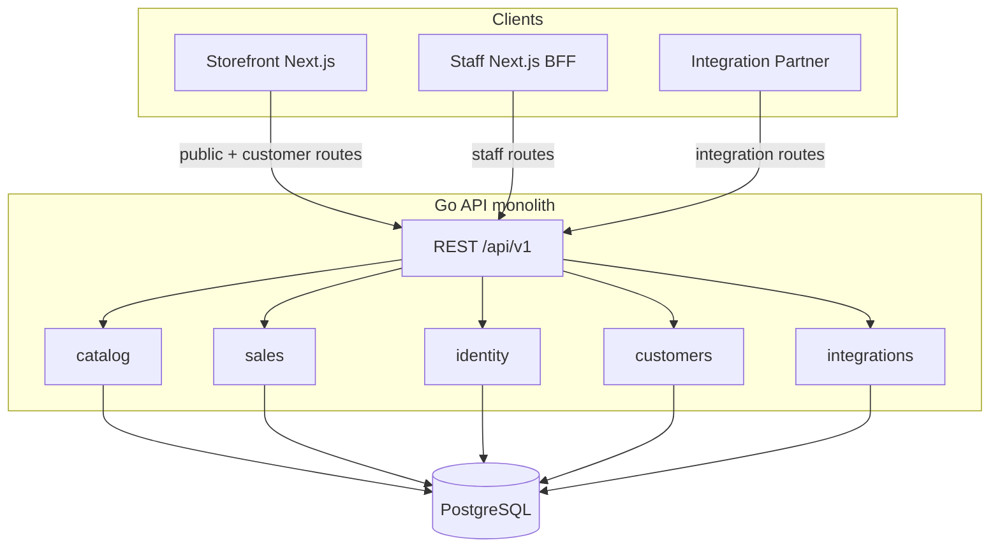

# Technical Design

## Purpose

This document specifies the technology stack, architecture, and engineering agreements for Ticket POS.
It grounds implementation choices in the business intent described in [business-intent.md](./business-intent.md).
The canonical domain vocabulary lives in [CONTEXT.md](../CONTEXT.md).

## Summary

Ticket POS is a **multi-tenant SaaS** delivered as a **monorepo** with three runtimes:

1. A **Go API** (single compiled binary) owning business logic and data access.
2. A **Storefront** Next.js app for public, SEO-first ticket sales.
3. A **Staff** Next.js app for authenticated catalog management, in-person sales, and sale imports.

All runtimes share one **PostgreSQL** database.
The Go backend is a **modular monolith**: one deployable, domain modules inside the codebase, no separate microservices at launch.



## Architecture decisions

| Topic | Decision |
|-------|----------|
| Tenancy model | Multi-tenant SaaS; single deployment; rows scoped by `organization_id` |
| Backend shape | Modular monolith in Go (single binary) |
| Runtimes at launch | Three: Go API, Storefront Next.js, Staff Next.js |
| Database | PostgreSQL 18 (Cloud SQL `POSTGRES_18`); Compose, the integration harness, and CI all pin the same major |
| Data access | Hand-written SQL via `database/sql`; no ORM; no query code generation |
| Migrations | Plain `.sql` files; small in-repo migration runner |
| Tenancy enforcement | Application layer; explicit `organization_id` in repositories; no RLS at launch |
| API style | REST + OpenAPI 3, versioned at `/api/v1/...` |
| Staff auth | Email OTP or Google Sign-In (ADR 0011) → Postgres session → httpOnly cookie; Staff app is a BFF; open signup with create-org onboarding |
| Integration auth | API keys or OAuth2 client credentials on Go API (separate from staff sessions) |
| Customer auth | Platform-global Customer, created for the person rather than by them; email OTP, Google Sign-In (ADR 0011), or a signed Confirmation Link → Postgres Customer Session → httpOnly cookie; Storefront is a BFF. Separate from staff identity (ADR 0010) |
| Payments | Provider-agnostic `PaymentProvider` boundary in `platform/`; PayPhone (redirect flow) is the launch provider, a stub serves when credentials are absent (ADR 0012, ADR 0013) |
| Platform Fee | Withheld from the Organization on Online Sales, never charged to the Customer; per-Event Fee Handling moves the buyer price only; rates in platform configuration, amounts snapshotted per sale line (ADR 0014) |
| Email (OTP) | Pluggable `EmailSender`; dummy provider logs codes to terminal in dev |
| Capacity accounting | Atomic decrement in Postgres transactions; row locks for multi-type sales |
| Sale Import | `.csv`/`.xlsx` upload parsed server-side; synchronous; all-or-nothing per batch; `direct` source first |
| Storefront URLs | Path-based tenancy: `/{orgSlug}/events/{eventSlug}` |
| Local development | Docker Compose + Make |
| Production hosting | TBD |
| CI | GitHub Actions; fast checks on PR; E2E on main/nightly |
| Observability | Structured logging via injected `Logger`; `X-Request-ID` correlation |

## Monorepo layout

```
ticket_pos/
  backend/                  # Go module (stdlib-first)
    cmd/server/
    cmd/migrate/
    internal/
      catalog/
      sales/
      identity/
      customers/
      integrations/
      platform/
    migrations/
  apps/
    storefront/             # Next.js (SEO / SSR / ISR)
    staff/                  # Next.js (BFF + POS mode)
  packages/
    api-client/               # TypeScript client generated from OpenAPI
    ui/                       # Shared design system (Tailwind + shadcn primitives)
  openapi/                    # OpenAPI 3 spec (contract source of truth)
  docker-compose.yml
  docker-compose.prod.yml     # production-parity stack (production image + migrate job)
  Makefile
  turbo.json
  package.json                # pnpm workspaces root
```

### JavaScript toolchain

- **pnpm** workspaces for package management.
- **Turborepo** for lint, typecheck, and build across apps and packages.
- **OpenAPI → TypeScript** client generation into `packages/api-client`.
- Staff and Storefront import the shared client; they do not hand-roll fetch types.
- **Shared UI** lives in `packages/ui` (Tailwind CSS v4, shadcn/ui-style primitives).
  Both apps import `@ticket-pos/ui` for components and global styles.
  Canonical UX guidelines live in [design/README.md](./design/README.md).

### Go toolchain

- Go module lives at `backend/`, sibling to `apps/`.
- Prefer the **Go standard library** for HTTP, JSON, logging, configuration, and migrations.
- **Minimal external dependencies**: a Postgres driver is required (`pgx` via the `database/sql` adapter, or `lib/pq`).

## Go backend

### Internal structure

Each domain module follows the same layering:

| Layer | Responsibility |
|-------|----------------|
| **handler** | HTTP request/response; input validation; maps domain errors to the standard envelope |
| **service** | Business rules; orchestrates transactions; returns typed domain errors |
| **repository** | Hand-written SQL; no business logic |

Cross-module calls go through **services**, not repositories.
Shared infrastructure lives in `internal/platform/` only.

```
backend/
  cmd/server/main.go
  internal/
    catalog/       # Events, Ticket Types
    sales/         # Online, in-person, and import sales; capacity logic
    identity/      # Organizations, members, roles, Staff Sessions
    customers/     # Customer records, Customer Sessions, Confirmation Links, Customer Area reads
    integrations/  # Partner credentials and integration route wiring
    invoicing/     # Tax invoicing: the platform's Issuer per country, Tax Invoices, the TaxAuthority seam (sri/ adapter)
    platform/      # DB pool, tx helpers, httputil (envelope + error mapping), tenancy middleware, OTP, Logger
  migrations/      # Plain SQL migration files
```

### Standard library first

| Concern | Choice |
|---------|--------|
| HTTP routing | `net/http` + `ServeMux` (Go 1.26+ method-aware routing) |
| JSON | `encoding/json` |
| Logging | `log/slog` behind an injected `Logger` interface |
| Configuration | Environment variables and/or `flag` |
| SQL | `database/sql` with hand-written queries |
| Migrations | `.sql` files applied via a small in-repo runner using `embed.FS` |

### Dependency injection

Construct dependencies in `cmd/server/main.go` and inject them into handlers and services.

- **Logger**: a small `Logger` interface in `platform/`, backed by `slog` in production.
  Services and repositories receive a logger instance; tests inject a no-op or capture logger.
- **Database**: a connection pool passed into repositories.
- **EmailSender**: pluggable interface for OTP delivery (see Authentication).

### Logging and request correlation

- Every HTTP request gets a unique **`X-Request-ID`** (generated if not present).
- Middleware attaches the request ID to the request-scoped logger.
- Staff and Storefront Next apps forward `X-Request-ID` on server-side calls to the Go API.
- Metrics, distributed tracing, and error reporting SaaS are **deferred** until production hosting is chosen.

## PostgreSQL and data access

### Schema conventions

- Every tenant-owned table includes **`organization_id`**.
- Repositories **always** require an explicit `organization_id` argument for tenant queries.
- There is no implicit tenant context in SQL strings; scoping is visible at every call site.

### Migrations

- Migration files are plain SQL in `backend/migrations/`.
- A migration table tracks applied versions.
- Migrations run on API startup in development and as a deploy step in production.
- CI applies migrations against a fresh database on every PR.

### No ORM, no query codegen

- SQL is written by hand in repository files.
- Scan results into Go structs manually.
- Repository integration tests run against a real Postgres instance (testcontainers in CI) to catch schema drift.

### Tenancy enforcement

- HTTP middleware resolves the active Organization from auth, session, or route parameters.
- Handlers pass `organization_id` into services; services pass it into repositories.
- **Postgres row-level security (RLS) is deferred** at launch.
- Integration and staff routes both resolve organization context before any catalog or sales work.

## Capacity and sales integrity

Remaining capacity on a Ticket Type must stay accurate across Online Sales, In-Person Sales, and Sale Imports, including under concurrent load.

Two mechanisms compose: `sold_count` records completed sales, and **Capacity Holds** derived from
pending Payments keep in-flight online checkouts from being oversold (see below).

### Single Ticket Type sales

Use an **atomic decrement** in the same transaction as inserting the Ticket Sale:

```sql
UPDATE ticket_types
SET sold_count = sold_count + $1
WHERE id = $2
  AND organization_id = $3
  AND sold_count + $1 <= capacity
```

If zero rows are updated, the sale is rejected (oversell).

### Multi Ticket Type sales

When one Ticket Sale spans multiple Ticket Types (a cart with several Ticket Sale Lines), acquire **row locks** (`SELECT ... FOR UPDATE`) on all involved ticket type rows inside a single transaction before decrementing.

### Sale Import batches

- A Sale Import (`.csv` or `.xlsx`, parsed server-side) runs as a **single database transaction** per batch.
- Lines are applied in order.
- If any line would oversell, the **entire batch fails** and rolls back.
- Partial-accept rules may be introduced later; at launch the behavior is all-or-nothing.

### Capacity Holds (online checkout)

A Customer must not be able to pay for tickets that sold out while they were on the provider's
payment page. Available capacity is therefore not `capacity − sold_count` alone but

```text
available = capacity − sold_count − quantities on pending Payments younger than the hold window (~20 min)
```

Holds are **derived, not stored** ([ADR 0013](./adr/0013-capacity-holds-derived-from-pending-payments.md)):
a pending Payment *is* the hold on its Ticket Types, expiry is a `created_at` cutoff in the query
(`sales/holds.go` is the single definition), and committing the sale converts the Payment's own
hold into `sold_count` under the existing row locks. There is no reservation table and no cleanup
job — Cloud Run runs no background workers (ADR 0007). Public remaining/sold-out figures subtract
live holds; every channel (POS, import, online) begins its commit against them. Stale pending
Payments are lazily flipped to `expired`; correctness never depends on that transition. The window
comfortably covers PayPhone's 10-minute form validity plus its 5-minute confirm window.

## API design

### REST + OpenAPI 3

The OpenAPI spec in `openapi/` is the **contract source of truth**.
It covers all four route groups on the same domain model.

| Route group | Prefix (illustrative) | Used by | Auth |
|-------------|----------------------|---------|------|
| **Public** | `/api/v1/public/...` | Storefront | None (org resolved from URL slug) |
| **Staff** | `/api/v1/staff/...` | Staff BFF | Staff session |
| **Customer** | `/api/v1/customer/...` | Storefront BFF | Customer Session (none on OTP request/verify, Google verify, and Confirmation Link redemption, where the credential is the request) |
| **Integration** | `/api/v1/integrations/...` | Integration Partners | API key or OAuth2 client credentials |

### Versioning

- All routes are versioned under `/api/v1/`.
- Breaking changes require a new API version; the prior version remains until partners migrate.

### Idempotency

Sale-creation endpoints that may be retried (online checkout, partner API calls) accept an **idempotency key** header.
The Go API stores the key and returns the original result on replay.

### Standard response envelope

Every JSON response uses the same top-level shape.
Success and failure differ only in which fields are populated.

```json
{
  "data": <resource or null>,
  "error": <error object or null>,
  "request_id": "<uuid>"
}
```

| Field | Success | Failure |
|-------|---------|---------|
| `data` | The response payload (resource object, list, or other endpoint-specific value) | `null` |
| `error` | `null` | Error object (see below) |
| `request_id` | Present | Present |

`request_id` mirrors the `X-Request-ID` header on every response.
Clients use it for support and log correlation; Integration Partners can read it from the body without inspecting headers.

On success, `data` holds the resource directly (not wrapped under a type-specific key).
Example for `GET /api/v1/staff/events/{id}`:

```json
{
  "data": {
    "id": "...",
    "name": "Summer Fest",
    "ticket_types": []
  },
  "error": null,
  "request_id": "abc-123"
}
```

The envelope is defined once in OpenAPI as a reusable schema.
Endpoint-specific `data` types reference it.

### Errors

Errors are separated by **layer**, not by response shape.

| Layer | Where it lives | Examples |
|-------|----------------|----------|
| **Handler** | Request parsing, auth, and input validation before the service is called | Malformed JSON, missing session, `price: -5` |
| **Domain** | Service business rules; translated to HTTP at the handler | Capacity exceeded, event not found in org, duplicate ticket type name |

Both layers produce the same `error` object.
Clients distinguish them by `code`, not by envelope structure.

```json
{
  "code": "CAPACITY_EXCEEDED",
  "message": "Not enough tickets remaining for VIP",
  "details": {}
}
```

| Field | Required | Purpose |
|-------|----------|---------|
| `code` | Yes | Stable machine-readable identifier; the client contract |
| `message` | Yes | Human-readable text, safe to show in Storefront and Staff UI at launch |
| `details` | No | Structured context (field errors, row numbers, IDs); shape varies by `code` |

#### Handler errors

The handler rejects invalid requests before calling the service.

Request validation (shape, required fields, types, formats) is **always** handler responsibility.
Validation failures return `400` with code `VALIDATION_FAILED`:

```json
{
  "data": null,
  "error": {
    "code": "VALIDATION_FAILED",
    "message": "Request validation failed",
    "details": {
      "fields": [
        { "field": "price", "message": "must be greater than 0" },
        { "field": "capacity", "message": "must be greater than 0" }
      ]
    }
  },
  "request_id": "abc-123"
}
```

Other handler-level codes include `INVALID_JSON`, `UNAUTHORIZED`, `FORBIDDEN`, `NOT_FOUND`, `METHOD_NOT_ALLOWED`, and `INTERNAL_ERROR`.

#### Domain errors

Services return typed domain errors; they never set HTTP status codes.
Each domain module owns its error types and stable codes (for example `catalog.ErrEventNotFound`, `sales.ErrCapacityExceeded`).
`platform/httputil` provides envelope helpers and a default mapping from domain errors to HTTP status:

| Pattern | HTTP status | Example `code` |
|---------|-------------|----------------|
| Resource not found | 404 | `EVENT_NOT_FOUND` |
| Conflict / state violation | 409 | `CAPACITY_EXCEEDED` |
| Permission denied | 403 | `FORBIDDEN` |

Handlers stay thin: call the service, pass any returned error to the mapper, write the envelope.

Example domain error (capacity exceeded on checkout):

```json
{
  "data": null,
  "error": {
    "code": "CAPACITY_EXCEEDED",
    "message": "Not enough tickets remaining for VIP",
    "details": {
      "ticket_type_id": "...",
      "requested": 5,
      "remaining": 2
    }
  },
  "request_id": "abc-123"
}
```

#### Batch failures (Sale Import)

Sale Import batches are all-or-nothing.
On failure, the API returns the **first** failing row only:

```json
{
  "data": null,
  "error": {
    "code": "IMPORT_BATCH_FAILED",
    "message": "Import would oversell at row 200",
    "details": {
      "row": 200,
      "reason": "CAPACITY_EXCEEDED"
    }
  },
  "request_id": "abc-123"
}
```

Staff fix the reported row and re-upload.
Returning all failing rows is deferred.

### TypeScript client

- `packages/api-client` is generated from the OpenAPI spec.
- CI fails if the spec changes without a corresponding client regeneration.

## Authentication

### Staff (proof of email ownership)

Staff authenticate by proving they own an email address, by **One-time Passcode** or by **Google Sign-In**
(ADR 0011). The two are equal in force and converge on the same Staff Session; nothing records which was
used. The passcode flow is described below and is the path Google Sign-In joins once it has established a
verified address.
There are no passwords at launch.
**Open signup** is supported: any valid email may request an OTP.
A new person with no existing Member records creates an Organization during onboarding and becomes Org Admin.

1. Staff enters their email address in the Staff app.
2. Go generates a short-lived OTP, stores a **hash** and expiry in Postgres.
3. The `EmailSender` delivers the code.
4. Staff submits the code; Go verifies it and creates a **server-side session** in Postgres.
5. Staff Next sets an **httpOnly session cookie**.
6. Staff Next BFF calls Go staff routes on behalf of the authenticated user.

After OTP verification, routing depends on membership count:

| Memberships | Next step |
|-------------|-----------|
| 0 | Create-organization onboarding |
| 1 | Auto-select the sole Member as active |
| 2+ | Organization picker, then dashboard |

A session stores the signed-in email and an optional **active Member** (`active_member_id`).
Authenticated requests without an active Member may access onboarding and org-picker routes only.
Staff workflow routes return **403 Forbidden** until an Organization context is selected.

Sessions use a **sliding 14-day** expiry extended on authenticated API use.

**Rate limiting** and lockout protect against brute-force OTP guessing.
Codes expire quickly (target: 10 minutes).

#### Email delivery

```go
type EmailSender interface {
    SendOTP(ctx context.Context, to string, code string) error
}
```

| Environment | Provider |
|-------------|----------|
| Development | Dummy provider: logs OTP to stdout/stderr |
| Production | TBD (e.g. Resend, SES, Postmark) |

### Integration Partners

- Authenticate with **API keys** or **OAuth2 client credentials**.
- Credentials are stored in Postgres and scoped to an Organization.
- Integration auth is separate from staff sessions.
- At launch, Integration scope is org-wide (equivalent to Org Admin per business intent).

### Customers

- **Guest checkout** at launch: no account is required to complete an Online Sale.
- A **Customer** record is nevertheless created or reused by *every* Ticket Sale on every Sales
  Channel, keyed on a normalised, platform-global unique email (ADR 0010). That is where essentially
  every record comes from; a completed sign-in mints one too, on the same email, for someone who
  signs in before their first purchase. Nobody registers on any path; the account is invisible,
  and `ticket_sales.customer_id` is `NOT NULL`.
- Signing in therefore only ever means proving ownership of an email address — almost always one a
  record already exists for. Three credentials do that, with deliberately different reach:
  - a **one-time passcode**, which yields a full **Customer Session** (sliding 180 days) spanning
    every Ticket Sale the Customer owns across every Organization, and sets `verified_at`;
  - a **Google Sign-In** (ADR 0011), equal in force to a passcode and converging on the same session
    and the same `verified_at` — Google proves the email, it is not a second identity, and nothing is
    stored about the Google account;
  - a **Confirmation Link** carried in the **Sale Confirmation** — a stateless token signed with
    `CONFIRMATION_LINK_SECRET`, valid until its Event ends plus a grace window so it still works at
    the gate, and minting only a ~24h session scoped to that one Ticket Sale.
- Customer identity is entirely separate from staff identity: separate tables, separate session
  records, separate cookies on separate origins. They share only the OTP mechanism, scoped by a
  `purpose` so a code minted for one surface cannot be redeemed on the other.
- A record created on someone's behalf is inert until verified: it receives no email beyond the Sale
  Confirmation its own sale triggered, and cannot be signed into.
- A Customer holds one current **Tax ID** — a **Tax ID Type** (`cedula` | `ruc` | `passport`) and
  its number — validated once in `platform.ValidateTaxID` and mirrored by clients for instant
  feedback only (ADR 0016). It is returned by `GET /api/v1/customer/auth/session` as
  `tax_id_type` / `tax_id_number` (both null until one exists) so the checkout dialog can prefill it.
  Write-back from a sale mirrors the customer-name rule with one addition: a sale may **fill** a
  never-set Tax ID and **refresh** it while the Customer is unverified, and may overwrite a verified
  one **only** when the checkout ran under that Customer's own full Customer Session.
- A Customer may hold a **Phone Number**, carried the same way and under the same write-back guard:
  one canonical E.164 string, validated in `platform.ValidatePhone` and mirrored by
  `apps/storefront/lib/phone.ts`, returned on the session as `phone` so the checkout dialog can
  prefill it. It exists for one reason — PayPhone's hosted form takes it as a prefill — so it is
  **optional everywhere and never fabricated**, and it is **sparsely populated** by design: only
  online checkout and "My info" collect it, never the staff-recorded sale form or the Sale Import,
  because those channels never call a Payment Provider. Unlike the Tax ID it is **not** snapshotted
  onto the Ticket Sale: ADR 0016 makes the Tax ID a fiscal fact of the sale, and a phone number is
  not one. The `payments` row carries it only so it survives the provider's return redirect.
- Each Ticket Sale's own **Tax ID snapshot** is what the buyer's paper trail shows, never the
  Customer's current assertion. It reaches the two buyer-facing surfaces as one rendering —
  `platform.SaleTaxID.Display()`, e.g. `Cédula: 1712345675`, unmasked and mirrored by
  `apps/storefront/lib/tax-id.ts`: the Sale Confirmation email (composed on
  `platform.SaleConfirmation`, not inside the delivery provider, so the integration suite can assert
  what a buyer reads through the capture sender) and `GET /api/v1/customer/ticket-sales`, whose
  per-sale payload carries `tax_id_type` / `tax_id_number`. Both are null together on sales recorded
  before the feature and on imported sales that never carried one; the email omits the line and the
  Customer Area draws `—`, because history is never backfilled.
- The Customer edits their own record through `PATCH /api/v1/customer/profile` — the "My info"
  section of the Customer Area and the customer namespace's only write. It takes `first_name`,
  `last_name`, `tax_id_type`, `tax_id_number` and `phone`, returns the updated profile beside the `email`,
  and rejects a blank first or last name: the customer-upsert guard reads a blank name as "never
  named", and this is the only write path that could falsify that. Sending both Tax ID halves null
  clears it; one without the other is a field-level validation failure. The phone clears on an
  explicit `null` or blank, but an **absent** `phone` key means "leave it alone" — deliberately
  unlike the Tax ID, whose absence clears. The Tax ID has been in this contract since it was
  written, whereas the phone was added to an existing one: during a deploy window a Storefront
  running the previous build sends no `phone` key, and it must not silently erase buyers' numbers.
  The email is not accepted —
  it is the Customer's identity. A **full** Customer Session is required: a Confirmation Link
  session is refused with `CUSTOMER_SESSION_SCOPE_INSUFFICIENT` (403), because possession of a
  forwarded Sale Confirmation is not ownership of the address. The edit moves the Customer's current
  assertion only; every Ticket Sale keeps the name and Tax ID it was transacted under.
- A Customer holds **Follows**: standing subscriptions to Organizations and to Tags, whose whole
  payload is the weekly **Follow Digest** (ADR 0030). They live in `customer_organization_follows`
  and `customer_tag_follows`, composite-primary-key join tables owned by the customers module, with
  `ON DELETE CASCADE` on both ends of each — a deleted Organization or Tag takes its Follows with it
  rather than orphaning rows that feed a mailing. **One table per followed thing, not one
  polymorphic table**: the cascade is what makes that rule true in the schema rather than in
  whichever service remembers, and a polymorphic subject column can carry no foreign key at all. The
  discriminator goes on the wire, where it costs nothing, instead of in storage, where it would cost
  referential integrity.
- The Follows surface is **five routes and one listing**. `GET /api/v1/customer/follows` returns
  **one list of every kind of Follow**, each entry carrying a `type` discriminator with the subject
  hanging off the field it names —
  `{"type":"organization","followed_at":…,"organization":{name,slug,logo_url}}` and
  `{"type":"tag","followed_at":…,"tag":{canonical_key,name,curated}}` — ordered `followed_at DESC`
  across **both kinds interleaved**, never grouped by kind. `POST`/`DELETE
  /api/v1/customer/follows/organizations/{slug}` and `POST`/`DELETE
  /api/v1/customer/follows/tags/{canonicalKey}` follow and unfollow. A further kind extends the same
  list rather than adding a second endpoint. The order is made **total** by tie-breaking on the
  identifier each kind is addressed by (slug, canonical key) and finally on `type`, because two
  Follows sharing an instant are ordinary and a listing that could return two orders for two
  identical reads would show as a shuffle. The two halves are read by their own queries and merged
  in the service, not `UNION`ed in SQL: a union would have flattened two differently-shaped subjects
  into one row of nullable columns and let the convenience of a single query dictate the published
  shape.
- Each subject is named by the identifier it is addressed by everywhere else — the Organization by
  **slug**, the Tag by **canonical key** — never by id. Neither public surface publishes an internal
  id, every Storefront address and every Tag chip already carries these, and an unknown one is the
  owning module's own `ORGANIZATION_NOT_FOUND` / `TAG_NOT_FOUND` (404), so the Follow routes are not
  an oracle the public surfaces are not. Both are resolved to an id **service-to-service**, through
  one-method interfaces declared on the customers side and implemented by identity and catalog
  respectively — the same shape as the reversal resolver. Resolving a Tag runs the pool's own
  canonicalization, so casing and spacing cannot produce two Follows of one Tag, and an unknown key
  is a 404 rather than a Tag quietly coined: Following never adds to the shared pool.
- **Every Tag is followable, Preset and Custom alike.** ADR 0030 rejected restricting the pool to
  `curated` Tags — the Digest's weekly cap bounds per-reader volume structurally, so narrowing what
  may be Followed buys nothing and costs the narrow interest that is the best reason to Follow a Tag.
  There is deliberately no such constraint in the schema or the resolver.
- Following is **idempotent** and answers 200 on every call, never 201 and never 409: the repeat
  returns the existing Follow with its original `followed_at` rather than moving it, so a retry or
  double tap is safe. Unfollowing something not followed is likewise not an error. All five routes
  require a **full** Customer Session and refuse a Confirmation Link session with
  `CUSTOMER_SESSION_SCOPE_INSUFFICIENT` (403).
  That is a session-scope check and not a second email-verification check, and it is the one place
  the "an active Customer Session implies a verified email" shorthand does not hold: a sale-scoped
  session is minted from a token in an email somebody was *sent*, does not set `verified_at`, and
  proves nothing about who controls the address — so honouring a Follow from a forwarded receipt
  would subscribe a stranger's inbox to mail, which ADR 0010 forbids.
- On the Storefront the Follow control is **one generic component** taking the BFF path to write to
  and the name to speak about, in a full form on the Organization page and a compact form beside the
  Tag chips on the Event page and the explorer. Size and signed-in-ness are independent axes: it is
  drawn for anybody, and for a visitor without a full Customer Session it renders as a way into
  sign-in carrying a Follow intent rather than as a write. One Follows read answers every control on
  a page, which is why the API lists Follows rather than offering a per-subject "do I follow this"
  probe, and a Follows read that failed is treated as signed-out — an unresolvable control is worth
  less than serving the page. `/following` in the Customer Area is the **management surface**: both
  kinds in one list, in the API's own order, with unfollow available there and an empty state that
  says what a Follow is for. It is deliberately **not a feed** — ADR 0030 builds no Following feed,
  because the payload of a Follow is the Digest and a second browsable stream would compete with the
  explorer.
- A **Follow intent** carries a Follow through sign-in, so an anonymous visitor who presses Follow
  lands back where they started with it made (#219). It travels as one string, `organization:<slug>`
  (`tag:<key>` when Tag Follows land), as an explicit `follow` parameter on the sign-in address and
  then as an optional `follow` field on **both** verification doors — `POST
  /api/v1/customer/auth/otp/verify` and `POST /api/v1/customer/auth/google/verify` — never in
  browser storage, so it is server-visible and validatable. Both doors answer with a `follow` field
  alongside `session`/`session_id`, holding the Follow that was made or `null`. The intent names a
  **subject and never a subscriber**: it is applied against the Customer Session that verification
  just minted, through the same service call the ordinary Follow endpoint uses, so an email supplied
  beside it can never become the address that gets subscribed. It is validated **before** the
  passcode is checked — a known kind, and a key matching the slug pattern `^[a-z0-9]+(?:-[a-z0-9]+)*$`
  under 100 characters, which admits no URL, path, host or address — and a malformed one is a 400
  `VALIDATION_FAILED` on field `follow` that does not spend the passcode. A subject that does not
  resolve does not fail the sign-in: the session is issued and `follow` is `null`. `POST
  /api/v1/customer/auth/confirmation-link` refuses a `follow` outright with
  `CUSTOMER_SESSION_SCOPE_INSUFFICIENT` (403), because that door mints a sale-scoped session and
  subscribing an address takes the same proof signing in does. On the Storefront the same guard runs
  in `lib/follow-intent.ts`, which drops a malformed intent rather than refusing the sign-in, and
  the Google leg carries it in the existing state cookie rather than through Google.
- **Suggested Follows are a sixth route and a second read, never a field on the listing** (ADR 0031).
  `GET /api/v1/customer/follow-suggestions` returns Tags and Organizations the Customer does not
  Follow, in **two groups rather than one interleaved list** — the opposite of the Follows listing,
  and for the reason that decided that one too: the listing interleaves because `followed_at` is a
  single real scale across both kinds, while a Tag's normalised co-occurrence score and an
  Organization's Activity are different units, and ordering them together would publish a
  comparability that does not exist. Subjects reuse the listing's own shapes, so the Storefront
  holds one type per kind. Each entry names the Tag that produced it **by canonical key**, never as
  a sentence: the Storefront words it from its own catalogues as it words every Tag (ADR 0027), and
  no language crosses the wire. An empty result is a 200 with empty groups. The route is deliberately
  **not** folded into `GET /customer/follows`, which the explorer and every Event and Organization
  page call to resolve their Follow controls — putting the ranking there would run it on every render
  of the hot public surfaces and discard the result.
- The ranking is **one query at request time**: no table, no migration, no cache, no scheduled
  recomputation. **Activity** counts discoverable upcoming Events, reusing the same subset the
  explorer lists and the index on `COALESCE(ends_at, starts_at)` migration 057 already added.
  **Co-occurrence** is a self-join through `event_tags`, normalised by each candidate Tag's own
  frequency so that the broadest Tags in the shared pool are not suggested to everyone. The starting
  set is the union of Tags the Customer Follows and Tags carried by their followed Organizations'
  upcoming Events, the latter **weighted lower and excluded from the results** — the derived Tag is
  an inference from a Follow the Customer already made, so offering it back is offering them their
  own answer. Organizations are reached through the same join, an Organization being related to a Tag
  when its upcoming Events carry it; there is no Organization–Tag table and this adds none. Custom
  Tags qualify above a floor of more than one upcoming Event, because a Custom Tag on a single Event
  is usually that Event's own name.
- On the Storefront the panel sits **below** the Follows list on `/following`, in one layout for
  both the populated and empty states, read **server-side** alongside the listing through the same
  customer-session module — no BFF route handler, because nothing here is operated by the browser
  except the Follow control, which already has one. Tags render as a compact chip row and
  Organizations as rows matching the Following list's shape, both reusing the same generic Follow
  control against the same endpoints, so accepting a suggestion is byte-for-byte the request the
  Event page makes and the control's own refresh is what moves it into the list above. A suggested
  Custom Tag carries the Following list's existing badge, in the same words. A failed suggestions
  read degrades to **no panel, silently** — the listing keeps its own error handling, and an error
  banner about a feature the reader did not come for is worse than its absence.
- The header's Following link is rendered by the Storefront's own customer-nav component in **both**
  its signed-in and signed-out branches, immediately before the Avatar chip. The shared shell package
  takes a node for the header's trailing edge and needs no change — it is shared with Staff, which
  has no Follows and must not learn of them. Shown signed-out, where it leads into sign-in carrying a
  return to `/following`, which the page already handles because it must already survive a signed-out
  arrival. The account menu keeps its own Following entry: the menu is the complete index of the
  Customer Area, the header link is a shortcut.
- Each Ticket Sale keeps its own immutable Tax ID snapshot, and that snapshot — not the Customer's
  current assertion — is what organizers see and search. `GET /api/v1/staff/events/{id}/sales`
  returns it per row as `tax_id_type` / `tax_id_number` (null together on sales recorded without
  one), and its unified `q` search adds a fourth branch over `customer_tax_id_number`: a
  case-insensitive substring, LIKE-escaped like the email/name/confirmation_ref branches, so a
  pasted full number and the last four digits read off an ID card both match. The search is
  **event-scoped** like the rest of the Sales list; there is no cross-event or cross-organization
  Tax ID lookup. Because the match runs over the snapshot, one Tax ID legitimately surfaces sales
  made from several Customer emails.

## Client applications

### Storefront (`apps/storefront`)

- **Next.js** with App Router.
- **SEO-first**: event and ticket type pages use SSR/ISR for crawlable content, canonical URLs, and Open Graph metadata.
- **Path-based tenancy**: `/{orgSlug}/events/{eventSlug}`.
- Calls the Go API **public** routes.
- Also acts as a **BFF** for Customer identity: the browser calls only the Storefront's own `/api/customer/...` route handlers, which hold the httpOnly Customer Session cookie and call the Go API **customer** routes (ADR 0008).
- Hosted on its own runtime (separate from Go and Staff).

Subdomains and custom domains per Organization are deferred.

### Staff (`apps/staff`)

- **Next.js** with App Router.
- Acts as a **BFF** (backend-for-frontend): the browser holds a session cookie with Staff; Staff server calls Go.
- The browser does not hold Integration-style API tokens.
- Covers catalog management, `.csv`/`.xlsx` Sale Import upload, and **in-person POS mode** (tablet-first UI within the same app).
- Calls the Go API **staff** routes.
- Hosted on its own runtime.

### Integration Partners

- Call the Go API **integration** routes directly.
- No web UI is required.
- Full management of events, catalog, and sales per business intent.

## Payments

Online Sales are paid through a **Payment Provider** behind a provider-agnostic boundary
([ADR 0012](./adr/0012-online-payments-platform-merchant-redirect-provider.md),
[ADR 0013](./adr/0013-capacity-holds-derived-from-pending-payments.md)). The platform is the
merchant of record: it holds the single merchant account per provider, credentials are platform
configuration (Secret Manager in production), and Organizations are settled outside the system.

### The PaymentProvider boundary

`platform.PaymentProvider` (`backend/internal/platform/payment.go`) mirrors the `EmailSender`
pattern (ADR 0009): a small interface — `Initiate`, `Confirm`, and a reserved `Reverse` — with the
implementation selected in `server.NewApp` by credential presence.

| Implementation | Selected when | Behavior |
|----------------|---------------|----------|
| **PayPhone** (`payment_payphone.go`) | `PAYPHONE_API_TOKEN` and `PAYPHONE_STORE_ID` are both set | Redirect flow ("Botón de pago"): `Initiate` calls PayPhone `Prepare` server-side and returns the hosted card-payment URL; `Confirm` calls `V2/Confirm` and reports the verdict. Raw `net/http`, no vendor SDK; USD integer cents end to end. `Prepare` also carries PayPhone's optional prefills — `email`, `documentId` (cédula and RUC only; a passport is withheld, and the Tax ID Type is never sent) and `phoneNumber` — so the hosted form arrives filled. A `4xx` retries **once** with all three stripped, reproducing the pre-prefill payload, so a systematic rejection degrades to the old form rather than failing checkouts; a `5xx` or a transport failure is never retried, because re-posting a charge request into silence risks a double charge |
| **Stub** | Either credential absent | Its "hosted payment page" is a dev-only Storefront interstitial (`/checkout/stub`) with Approve and Decline actions driving the same redirect legs. A production Storefront build 404s that route unless `STOREFRONT_STUB_PAYMENTS=1` (parity stack only) |

A second real provider requires only a new implementation of this interface — credentials flow
through the implementation, never through domain code. `PAYPHONE_API_BASE_URL` exists so the
integration suite can point the provider at a fake PayPhone server, and the API **refuses to start
in production with it set**, exactly like `GOOGLE_TOKEN_ENDPOINT`.

### The Payment aggregate

A **Payment** (`payments` + `payment_lines`, migration 019) records each attempt: provider name,
our `client_transaction_id`, the provider's ids, amount, a snapshot of Ticket Type quantities and
unit prices (so a catalog edit mid-payment cannot change what was bought), and the checkout
email/name/Tax ID. Everything the recorded sale needs is snapshotted at begin-checkout because
confirm arrives on the provider's redirect and carries none of the form — including
`customer_session_authorized` (migration 027), which remembers that the begin request ran under the
buyer's own Customer Session and is what lets their overrides replace the values a Verified Customer
already holds. It is a fact about the checkout, not about any one field of it, so it travels on the
buyer (`platform.SaleCustomer.SelfAsserted`) and guards every value the Customer upsert may write
back — the Tax ID and the phone today (#111).
Lifecycle:

```text
pending ──approved──▶ approved   (Ticket Sale committed in the SAME transaction)
   │ └────declined──▶ failed     (no sale, capacity untouched)
   └──hold lapses───▶ expired    (lazily marked; a late confirm may still commit if capacity remains)

(zero total) ───────▶ approved   (settled in the begin request; no provider, no hold, no confirm leg)
```

A Ticket Sale exists **only** for an approved Payment, committed through the channel-agnostic
sale-commit spine (row locks, `sold_count` increment, Customer upsert) in the same transaction that
marks the Payment approved, with Payment Method `payphone` — or `free` where there was nothing to
collect ([ADR 0017](./adr/0017-zero-total-checkouts-settle-without-a-payment-provider.md)). A cart of
Free Ticket Types totals zero, so no Payment Provider can be asked to collect it: that Payment is
created and approved inside the begin-checkout request, never passes through a state a Capacity Hold
is derived from, and has no confirm leg to arrive later. `approved` therefore means the checkout is
settled, not that money moved. One paid ticket anywhere in the cart makes the whole checkout an
ordinary provider checkout. Confirm is **idempotent**, keyed on our
client transaction id: a refreshed return page replays the recorded outcome and never
double-commits. If the provider approves but the sale commit fails, the Payment is left
approved-without-sale as a durable marker and the incident is logged loudly
(`PAYMENT_APPROVED_WITHOUT_SALE`) for the operator to resolve by hand.

### Redirect flow through the Storefront BFF

Nothing external may call the Go API (ADR 0008), so the provider's return redirect lands on a
**Storefront route handler**, which asks the API to confirm:

1. `POST /api/v1/public/organizations/{slug}/events/{eventSlug}/checkout` (guest; a Customer
   Session is optional and never required) validates the cart against live capacity and the
   buyer's `customer_tax_id_type` / `customer_tax_id_number`, plus the optional `customer_phone`
   (absent is valid and simply means no phone), records a `pending` Payment, calls
   `PaymentProvider.Initiate`, and returns `status: "pending"` with the hosted payment URL.
   A cart totalling zero skips every provider step: it settles on the spot and returns
   `status: "approved"` with the `confirmation_ref` and no `redirect_url`, ending the flow here
   (ADR 0017). Steps 2–4 below are the paid path only.
2. The browser is redirected to the provider's payment page (top-level, never an iframe).
3. The provider redirects back to `{storefront}/checkout/return`, whose handler relays the return
   params to `POST /api/v1/public/checkout/{clientTransactionId}/confirm`.
4. The API calls `PaymentProvider.Confirm` and settles the Payment; the handler lands the Customer
   on `/checkout/success` (with the Sale Confirmation reference) or `/checkout/failed` (with a
   retry that starts a fresh Payment under a new client transaction id).

### No webhooks: the auto-reversal policy

PayPhone has no webhooks; the Customer's return redirect is the **only** confirm trigger, and
PayPhone auto-reverses any charge not confirmed within 5 minutes. A Confirm whose outcome is
unknown (HTTP failure, unrecognized status) is an error that leaves the Payment `pending` — never a
decline — so a page refresh retries inside the window. A lost redirect ends in auto-reversal: an
automatically refunded Customer and a lost sale, money-safe by construction. A rescue reconciler
(Cloud Scheduler) is a documented follow-up, not part of v1.

**Refunds are out of scope** (ADR 0012): reversal of a completed Online Sale is manual on the
provider's dashboard — every Payment stores the provider transaction id for cross-referencing —
and the boundary reserves `Reverse` so a future flow needs no interface change.

### The money model: Platform Fee, Net Proceeds, Payouts

The platform withholds a **Platform Fee** (10% at launch) from the Organization on every Online
Sale, plus the **Fee IVA** (15%) levied on that fee — the fee is the platform's taxable service,
the tickets are not. The fee is **never charged to the Customer**
([ADR 0014](./adr/0014-platform-fee-charged-to-organization.md)); the per-Event **Fee Handling**
switch (`pass_on`, the default, or `absorb`, migration 021) only decides whether the buyer price is
raised to cover it.

**Fee math** lives in exactly one place per runtime: `sales.FeeRates`
(`backend/internal/sales/fees.go`), mirrored for the staff forms' derived lines by
`apps/staff/lib/fees.ts` and held to the same rounding table. It is per-unit, in integer cents,
rounded half-up, with the Fee IVA taken on the **already-rounded** fee:

```text
fee      = round_half_up(base × fee_rate)
fee_iva  = round_half_up(fee  × iva_rate)
buyer unit price = base + fee + fee_iva   (pass_on)   |   base   (absorb)
net proceeds     = buyer unit price − fee − fee_iva
```

Per-unit is the load-bearing part: every displayed price, line total, charged amount, and reported
figure is a sum of the same unit values in a different order, so they cannot drift by a penny. A
comp line (base 0) yields fee 0.

**Rates are configuration**, not code: `PLATFORM_FEE_BASIS_POINTS` / `PLATFORM_FEE_IVA_BASIS_POINTS`
(basis points, defaulting to the launch 10% / 15%) reach the API as `platform.Config.Fees` and are
injected into the catalog and sales services as `sales.FeeRates`. An out-of-range or malformed value
is a **startup refusal**, never a silent fallback. Neither variable is set in production, which runs
on the launch defaults; an IVA reform is therefore an ops action (add the variable to the API
service) rather than a deploy of new code.

**Per-line snapshots** are what keep a rate change from rewriting history. Checkout begin reads the
Event's Fee Handling once and freezes `base_price_cents`, `fee_cents`, `fee_iva_cents` and the two
rates used onto the `payment_lines`; confirm copies them verbatim onto `ticket_sale_lines`
(migration 022). A Fee Handling flip or a rate change while a Payment is pending moves nothing about
that Payment. `unit_price_cents` keeps its meaning on both tables — what the Customer paid per unit
— so Sales-list rows, the Customer Area, and the Sale Confirmation email need no arithmetic, and
`amount_cents` stays the gross charged. Only Online Sales carry a fee; in-person and imported lines
record their base price with fee 0 (the columns' default), so no Organization is ever billed for
cash the platform never held.

**Net Proceeds** is read off those snapshots and never recomputed from current rates:
`quantity × (unit_price_cents − fee_cents − fee_iva_cents)` summed over the lines of `active` sales
with `channel = 'online'`. The same expression serves both surfaces —
`GET /api/v1/staff/events/{id}/sales/summary` (the Sales tab stat strip; Org Admins and Event Owners
only, Event Staff are refused the route) and `GET /api/v1/staff/organization/payouts` (Org Admin
only). Neither branches on Fee Handling, because `unit_price_cents` already absorbs the difference.
The platform's cut is never returned as a number: the payloads carry the net figure and nothing to
subtract it from.

**Payouts** (`payouts`, migration 023) are bare operator-recorded facts — Organization, amount,
paid-at DATE, optional note — with no states, no approvals and no create endpoint: the platform
operator inserts a row after settling off-platform. The **Withdrawable Balance** is Σ Net Proceeds
across the Organization's active Online Sales − Σ Payouts, and is **signed**: a sale reversed after
it was paid out shows negative rather than clamping to zero.

The **PayPhone request shape is unchanged** by all of this, in both modes: the whole charge rides in
`amountWithoutTax` with no tax fields populated. That is the point of charging the Organization
rather than the Customer (ADR 0014) — the payment integration carries no per-mode fiscal branching,
and the fee model stops at the provider boundary.

## Sale Import

A Member who can manage an Event's sales uploads a batch of Ticket Sales as a **`.csv` or `.xlsx` file**.
Each batch carries a **Sales Source**: `direct` (the Organization's own off-platform sales) or `external_platform` (a third-party service such as Eventbrite).
The **`direct` source ships first** (roadmap V6); `external_platform` reuses the same pipeline later.

### Format (launch — `direct` source)

Both `.csv` and `.xlsx` are parsed **server-side in Go** (via an xlsx library such as `excelize`); uploading the raw file keeps one authoritative parse/validate/commit core that external-platform CSVs and the Integration Partner API can reuse.
A per-Event `.xlsx` **template** is generated server-side, pre-listing the Event's Ticket Types as a locked dropdown with the internal id in a hidden column to prevent mismatches.

| Column | Required | Description |
|--------|----------|-------------|
| `customer_email` | Yes | Buyer email (Sale Confirmation is sent here) |
| `customer_first_name` | Yes | Buyer first name |
| `customer_last_name` | Yes | Buyer last name |
| `ticket_type` | Yes | Ticket Type (dropdown; backed by hidden internal id) |
| `quantity` | Yes | Number of tickets sold |
| `payment_method` | Yes | `cash` or `transfer` |
| `sold_at` | Yes | When the sale occurred (ISO 8601; Excel dates coerced; Event timezone) |
| `amount` | No | Unit price charged; blank → catalog price (`0` = comp) |
| `customer_tax_id_type` | No | Tax ID Type (dropdown: `cedula`, `ruc`, `passport`) |
| `customer_tax_id_number` | No | Tax ID number, validated by the shared validator when supplied |

The Tax ID pair is optional here and only here: imported sales happened elsewhere, where the ID may never have been collected (ADR 0016).
Both halves are filled in together — one without the other is a row error — and a present-but-invalid value is reported per row in the preview, naming the failing column, before anything commits.

One file row = one Ticket Sale = one Ticket Sale Line. Grouping lines into one sale via an optional `order_ref` is deferred.

### Processing

- Staff uploads via the Staff app → Staff BFF → Go staff routes (template download, **preview**, **commit**, **undo**), scoped to an Event and gated by `can_manage_event_sales`.
- **Preview** parses and validates every row server-side and returns all problems at once (unknown type, bad email, missing field, future `sold_at`, invalid Tax ID, oversell, and soft duplicate flags matching an existing sale on `email + ticket_type + sold_at`), plus the capacity impact. No writes.
- **Commit** runs **synchronously** in a **single transaction**: re-validate under row locks, insert sales + lines, decrement capacity, record the batch, and email each buyer a Sale Confirmation. Oversell fails the entire import (`IMPORT_BATCH_FAILED`); a replayed idempotency key returns the original result.
- Oversell is **blocked, not clamped** — `sold_count ≤ capacity` always holds; Staff raise the Ticket Type's capacity (an inline catalog edit) and re-preview.
- The **latest** committed batch per Event can be **undone** (reverse sales, restore capacity), sending void emails only when the caller opts in.
- A reasonable row limit applies (target: 10,000 rows per batch).
- Async processing and the `external_platform` source are deferred.

## Tax invoicing

The platform issues electronic facturas to Ecuador's SRI for the one taxable service it sells — the Platform Fee with its Fee IVA — by hand, from the Operator Dashboard (#450, ADR 0059; vocabulary in `CONTEXT.md` *Tax invoicing*).
The platform is the **sole Issuer**: one RUC, one certificate, one set of authorizations per environment. No Organization is an emisor and no Member, Integration Partner or Customer route exists.

### The `invoicing` module

`internal/invoicing/` follows the domain / repository / service / handler split and is served on the operator namespace under `/api/v1/operator/invoicing/*`, behind the operator allowlist middleware and nothing else.
It owns its own tables and, so far, reads none of anyone else's: no Sale, Payout or Organization is linked.

It is a **thin cross-country core with a country adapter**:

| Where | Owns |
|-------|------|
| `internal/invoicing` (core) | `Issuer` (id, country, environment, certificate custody from #452), `Environment` (`test` / `production` — the platform's words, never an authority's codes), the `TaxAuthority` seam, and from #454 the Tax Invoice, its lines and additional fields, and the append-only attempts ledger |
| `internal/invoicing/sri` (Ecuador adapter) | Everything only the SRI cares about: the clave de acceso, the secuencial, factura XML v1.1.0 building, XAdES-BES signing, the SOAP transport and the SRI's error-code mapping |

The **`TaxAuthority` seam** has two operations — *submit a prepared document* and *query the outcome by the authority's reference* — and the core drives the status machine (pending / authorized / not authorized / rejected) off those two calls.
The adapter never touches a table; the core never learns SOAP, XML or an authority's error codes.
A second country is a second adapter, a second Issuer row and a second detail table, never a column on the core.

The country code is **visible in the route path** (`/operator/invoicing/issuers/ec`) so the seam is a fact of the API, not only of the code.
The Ecuador Issuer's SRI details (`EcuadorIssuerDetails`: RUC, razón social, nombre comercial, both direcciones, establecimiento, punto de emisión, obligado a llevar contabilidad, régimen, optional agente de retención) currently sit in the core package as a self-contained file; they belong to the adapter and may move under `sri` without changing shape once that package exists.

### Storage

Migration 094 lands the Issuer only: `invoicing_issuers` (country unique, environment), `invoicing_issuers_ec` (the SRI details, one-to-one), and `invoicing_sequences_ec` keyed by (issuer, environment, cod_doc, estab, pto_emi), created on first use and bumped with a single `UPDATE … RETURNING` so two concurrent issues get distinct numbers.
Migration 095 adds the certificate to the core row: the sealed `.p12` and password (`BYTEA`, nonce ‖ ciphertext ‖ tag as `invoicing.Custody` writes them) and the clear metadata — subject, the RUC found inside the certificate (`''` when none), validity window, SHA-256 fingerprint, upload time — under a CHECK that makes them all-or-nothing.
Migration 096 lands the Tax Invoice (#454): `invoicing_invoices` (Recipient snapshot columns, Issuer snapshot JSON, money in cents, currency `USD`, signed XML and authorization XML as `BYTEA`, last messages JSON, issuing operator's email, status), `invoicing_invoice_lines`, `invoicing_additional_fields`, `invoicing_invoices_ec` (clave de acceso unique, secuencial, with a uniqueness constraint over issuer/environment/cod_doc/estab/pto_emi/secuencial) and the append-only `invoicing_attempts` ledger. Nothing issued is ever deleted, and there is no down path for an issued document. The Issuer freezes (RUC once any invoice exists; establecimiento and punto de emisión once a sequence row exists under them) are a later change.

The `sri` adapter is the Ecuador `TaxAuthority`: it carries a prepared factura to recepción (`validarComprobante`) and polls autorización (`autorizacionComprobante`) for the verdict, over hand-written SOAP 1.1 envelopes on `net/http`, at endpoints hard-coded per environment (celcer for test, cel for production). A single `SRI_BASE_URL` override points every call at a stand-in for local development and the integration suite's fake SRI; `LoadConfig` refuses it in production, the way `PAYPHONE_API_BASE_URL` is refused, because it decides which server the platform believes authorized a factura. The issue flow is one request: allocate the secuencial with a single `UPDATE … RETURNING`, compute the clave, snapshot Issuer and Recipient, build and sign, insert `pending` and commit; then submit and poll autorización within a budget, mapping the SRI's answers onto `authorized` / `not_authorized` / `rejected` / `pending` and writing one attempts row per call.
Nothing issued is ever deleted.

### The certificate key

The signing `.p12` and its password are stored AES-256-GCM encrypted in Postgres under `INVOICING_CERTIFICATE_KEY` (32 bytes, base64; Secret Manager → env in production, `.env` locally), the way the Confirmation Link key is delivered.
The key is absent-safe: the app boots and serves everything else without it, and only certificate upload and signing fail with `CERTIFICATE_KEY_NOT_CONFIGURED` (503), which the Issuer page shows plainly so a failed upload is not mistaken for a bad file.
A key that is set but does not decode to 32 bytes is a startup failure (`LoadConfig`), so a mistyped secret never looks like a missing one.
The upload is a multipart `POST /operator/invoicing/issuers/ec/certificate` (`file` + `password`) through the API — never a presigned browser upload, the buckets being public — and the `.p12` is opened with `sri.OpenCertificate` before anything is stored: a wrong password, a file without an RSA key and a file that is not a `.p12` are `CERTIFICATE_PASSWORD_INCORRECT`, `CERTIFICATE_NO_RSA_KEY` and `CERTIFICATE_FILE_INVALID`, each leaving the previous certificate untouched; a re-upload replaces outright.
The Issuer read carries a `certificate` object (metadata only, `null` when none) and `certificate_ruc_mismatch`, true only when the certificate names a RUC and it is not the Issuer's — a warning on the page, never a block, since the SRI's own check is the final word.
`Service.OpenEcuadorSigningKey` is the only decryption path: it opens the sealed bytes into an `*sri.Certificate` in memory for one signing (#454) and nowhere else.
Landed with #453.

## Local development

### Docker Compose

`docker-compose.yml` starts all services needed for local development:

| Service | Role |
|---------|------|
| **postgres** | Database (`postgres:18-alpine`; PGDATA lives under `/var/lib/postgresql/18/docker`, so the volume mounts `/var/lib/postgresql`) |
| **backend** | Go API with [Air](https://github.com/air-verse/air) live reload (`Dockerfile.dev`; source mounted) |
| **storefront** | Storefront Next.js dev server |
| **staff** | Staff Next.js dev server |

The backend dev container watches `.go` files and rebuilds/restarts the API on change.
Production builds use `backend/Dockerfile` (compiled binary, no Air).

### Production-parity stack

`docker-compose.prod.yml` is a second, independent stack (Compose project `ticket-pos-prod`) that runs the
API from the **production** image and applies migrations the way Cloud Run will — see
[gcp-deployment.md](./gcp-deployment.md). It exists so image-only breakage is caught locally rather than at
first deploy. It covers the API only; the Next.js apps join it later.

`backend/Dockerfile` builds **both** binaries, `/server` and `/migrate`, into one image. Cloud Run deploys
the API service and the migration Job from that same digest, differing only in entrypoint; migrations are
`go:embed`ed into the binary, so nothing else travels with it.

| Service | Role |
|---------|------|
| **postgres** | Same `postgres:18-alpine` as dev, own volume |
| **minio** / **minio-init** | S3-compatible storage, bucket bootstrap |
| **migrate** | One-shot: production image, `/migrate` entrypoint, `DATABASE_URL` its only input. Stands in for the Cloud Run Job |
| **api** | Production image, `/server` entrypoint, `APP_ENV=production` and `RUN_MIGRATIONS=false` |

`api` waits on `migrate` via `service_completed_successfully`, so the schema is always current before the
server boots and the server never migrates. Host ports are distinct from the dev stack, so both can run at
once.

### Make

`Makefile` provides the primary developer entrypoints:

| Target | Purpose |
|--------|---------|
| `make dev` | Start the full Compose stack |
| `make down` | Stop services |
| `make prod` | Start the production-parity stack (`docker-compose.prod.yml`) |
| `make prod-down` | Stop the production-parity stack |
| `make test` | Run fast Go unit tests (excluding integration) and JS tests |
| `make test-integration` | Run HTTP integration tests (`backend/integration/`) |
| `make ci` | Run full pre-push checks locally (Go suite including integration, vet, turbo lint/typecheck/build) |
| `make migrate` | Apply database migrations |

Integration test authoring rules, harness behavior, and the E2E boundary are documented in [testing.md](./testing.md).

## CI/CD

### GitHub Actions

**On every pull request (fast):**

- `go test ./...` and `go vet` (includes HTTP integration tests in `backend/integration/` with testcontainers Postgres)
- Repository exception tests for concurrency and locking where applicable
- `turbo lint`, `typecheck`, `build`
- OpenAPI client sync check
- Migration apply on a fresh database

See [testing.md](./testing.md) for the three-layer testing model, harness usage, and commands.

**On main / nightly (slower):**

- E2E smoke tests via Docker Compose + Playwright
- Example flow: Organization creates an Event → Online Sale → capacity is correct

### Production deployment

Production hosting for the three runtimes and managed Postgres is **TBD**.
The local Compose setup is the reference environment until a production target is chosen.

## Deferred

The following are explicitly out of scope for this technical design at launch:

| Topic | Notes |
|-------|-------|
| Payment refunds & reconciler | Refunds of Online Sales are manual on the provider dashboard; no rescue reconciler for paid-but-never-returned Customers (auto-reversal is the v1 safety net, ADR 0012) |
| Production email provider | Dummy logger in dev; vendor TBD |
| Postgres RLS | App-layer tenancy is sufficient at launch |
| Async workers | Sale Import is synchronous; no separate job runtime |
| Subdomains / custom domains | Path-based URLs only |
| OAuth / SSO for staff | Email OTP at launch |
| Kubernetes | Simple deployments until scale requires it |
| Metrics and distributed tracing | Structured logs + request IDs at launch |
| Customer preferences, notifications, and profile editing | Customer identity ships read-only (ADR 0010); these hang off a stable Customer id later |
| Stripe Terminal / in-person card capture | In-person sales recorded in POS; card capture TBD |
| JSON / async Sale Import | Synchronous `.csv` / `.xlsx` upload at launch |
| Per-event Integration scope | Org-wide per business intent |

## Success criteria (technical)

- `make dev` brings up a working stack: Postgres, Go API, Storefront, and Staff.
- An engineer can trace any HTTP request across Staff → Go via a shared `X-Request-ID`.
- Hand-written SQL is tested against a real Postgres instance in CI.
- The OpenAPI spec, Go handlers, and TypeScript client stay in sync.
- Every API response uses the standard envelope (`data`, `error`, `request_id`).
- Capacity remains correct under concurrent sales across channels (verified by integration and E2E tests).
- Domain module boundaries in Go align with the vocabulary in CONTEXT.md.

## Related documents

- [business-intent.md](./business-intent.md) - business scope, actors, and product decisions
- [testing.md](./testing.md) - HTTP integration testing guide and E2E boundary
- [CONTEXT.md](../CONTEXT.md) - canonical domain glossary
