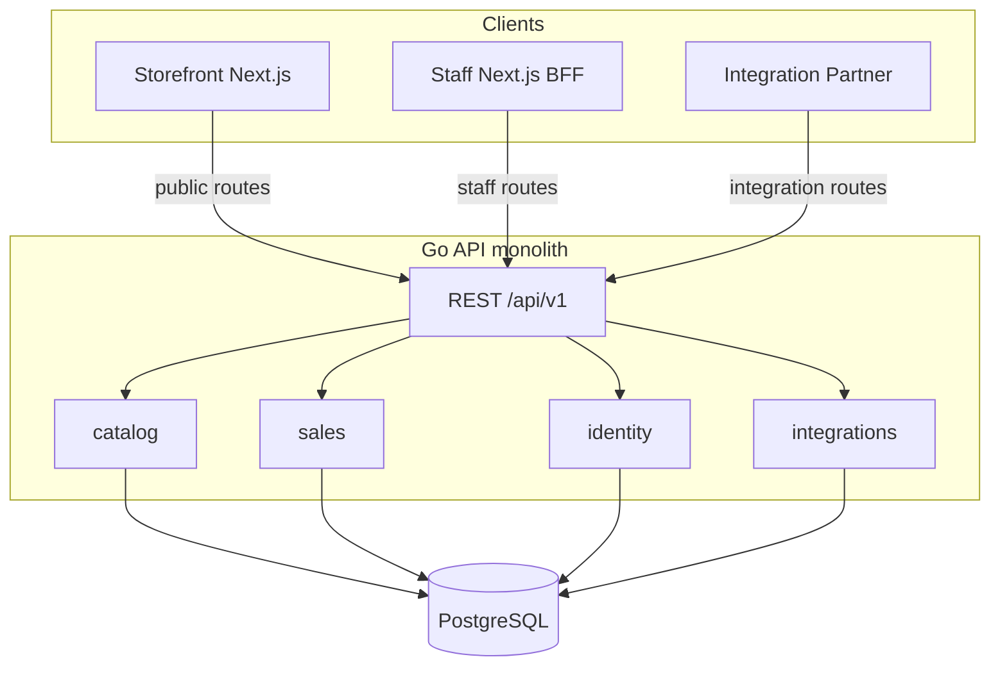

# Technical Design

## Purpose

This document specifies the technology stack, architecture, and engineering agreements for Ticket POS.
It grounds implementation choices in the business intent described in [business-intent.md](./business-intent.md).
The canonical domain vocabulary lives in [CONTEXT.md](../CONTEXT.md).

## Summary

Ticket POS is a **multi-tenant SaaS** delivered as a **monorepo** with three runtimes:

1. A **Go API** (single compiled binary) owning business logic and data access.
2. A **Storefront** Next.js app for public, SEO-first ticket sales.
3. A **Staff** Next.js app for authenticated catalog management, in-person sales, and sale imports.

All runtimes share one **PostgreSQL** database.
The Go backend is a **modular monolith**: one deployable, domain modules inside the codebase, no separate microservices at launch.



## Architecture decisions

| Topic | Decision |
|-------|----------|
| Tenancy model | Multi-tenant SaaS; single deployment; rows scoped by `organization_id` |
| Backend shape | Modular monolith in Go (single binary) |
| Runtimes at launch | Three: Go API, Storefront Next.js, Staff Next.js |
| Database | PostgreSQL |
| Data access | Hand-written SQL via `database/sql`; no ORM; no query code generation |
| Migrations | Plain `.sql` files; small in-repo migration runner |
| Tenancy enforcement | Application layer; explicit `organization_id` in repositories; no RLS at launch |
| API style | REST + OpenAPI 3, versioned at `/api/v1/...` |
| Staff auth | Email OTP → Postgres session → httpOnly cookie; Staff app is a BFF |
| Integration auth | API keys or OAuth2 client credentials on Go API (separate from staff sessions) |
| Customer auth | Guest checkout at launch |
| Payments | Provider-agnostic boundary; no vendor chosen |
| Email (OTP) | Pluggable `EmailSender`; dummy provider logs codes to terminal in dev |
| Capacity accounting | Atomic decrement in Postgres transactions; row locks for multi-type sales |
| Sale Import | CSV upload; synchronous processing; all-or-nothing per batch |
| Storefront URLs | Path-based tenancy: `/{orgSlug}/events/{eventSlug}` |
| Local development | Docker Compose + Make |
| Production hosting | TBD |
| CI | GitHub Actions; fast checks on PR; E2E on main/nightly |
| Observability | Structured logging via injected `Logger`; `X-Request-ID` correlation |

## Monorepo layout

```
ticket_pos/
  backend/                  # Go module (stdlib-first)
    cmd/server/
    internal/
      catalog/
      sales/
      identity/
      integrations/
      platform/
    migrations/
  apps/
    storefront/             # Next.js (SEO / SSR / ISR)
    staff/                    # Next.js (BFF + POS mode)
  packages/
    api-client/               # TypeScript client generated from OpenAPI
  openapi/                    # OpenAPI 3 spec (contract source of truth)
  docker-compose.yml
  Makefile
  turbo.json
  package.json                # pnpm workspaces root
```

### JavaScript toolchain

- **pnpm** workspaces for package management.
- **Turborepo** for lint, typecheck, and build across apps and packages.
- **OpenAPI → TypeScript** client generation into `packages/api-client`.
- Staff and Storefront import the shared client; they do not hand-roll fetch types.

### Go toolchain

- Go module lives at `backend/`, sibling to `apps/`.
- Prefer the **Go standard library** for HTTP, JSON, logging, configuration, and migrations.
- **Minimal external dependencies**: a Postgres driver is required (`pgx` via the `database/sql` adapter, or `lib/pq`).

## Go backend

### Internal structure

Each domain module follows the same layering:

| Layer | Responsibility |
|-------|----------------|
| **handler** | HTTP request/response; input validation; maps domain errors to the standard envelope |
| **service** | Business rules; orchestrates transactions; returns typed domain errors |
| **repository** | Hand-written SQL; no business logic |

Cross-module calls go through **services**, not repositories.
Shared infrastructure lives in `internal/platform/` only.

```
backend/
  cmd/server/main.go
  internal/
    catalog/       # Events, Ticket Types
    sales/         # Online, in-person, and import sales; capacity logic
    identity/      # Organizations, members, roles, OTP, sessions
    integrations/  # Partner credentials and integration route wiring
    platform/      # DB pool, tx helpers, httputil (envelope + error mapping), tenancy middleware, Logger
  migrations/      # Plain SQL migration files
```

### Standard library first

| Concern | Choice |
|---------|--------|
| HTTP routing | `net/http` + `ServeMux` (Go 1.26+ method-aware routing) |
| JSON | `encoding/json` |
| Logging | `log/slog` behind an injected `Logger` interface |
| Configuration | Environment variables and/or `flag` |
| SQL | `database/sql` with hand-written queries |
| Migrations | `.sql` files applied via a small in-repo runner using `embed.FS` |

### Dependency injection

Construct dependencies in `cmd/server/main.go` and inject them into handlers and services.

- **Logger**: a small `Logger` interface in `platform/`, backed by `slog` in production.
  Services and repositories receive a logger instance; tests inject a no-op or capture logger.
- **Database**: a connection pool passed into repositories.
- **EmailSender**: pluggable interface for OTP delivery (see Authentication).

### Logging and request correlation

- Every HTTP request gets a unique **`X-Request-ID`** (generated if not present).
- Middleware attaches the request ID to the request-scoped logger.
- Staff and Storefront Next apps forward `X-Request-ID` on server-side calls to the Go API.
- Metrics, distributed tracing, and error reporting SaaS are **deferred** until production hosting is chosen.

## PostgreSQL and data access

### Schema conventions

- Every tenant-owned table includes **`organization_id`**.
- Repositories **always** require an explicit `organization_id` argument for tenant queries.
- There is no implicit tenant context in SQL strings; scoping is visible at every call site.

### Migrations

- Migration files are plain SQL in `backend/migrations/`.
- A migration table tracks applied versions.
- Migrations run on API startup in development and as a deploy step in production.
- CI applies migrations against a fresh database on every PR.

### No ORM, no query codegen

- SQL is written by hand in repository files.
- Scan results into Go structs manually.
- Repository integration tests run against a real Postgres instance (testcontainers in CI) to catch schema drift.

### Tenancy enforcement

- HTTP middleware resolves the active Organization from auth, session, or route parameters.
- Handlers pass `organization_id` into services; services pass it into repositories.
- **Postgres row-level security (RLS) is deferred** at launch.
- Integration and staff routes both resolve organization context before any catalog or sales work.

## Capacity and sales integrity

Remaining capacity on a Ticket Type must stay accurate across Online Sales, In-Person Sales, and Sale Imports, including under concurrent load.

### Single Ticket Type sales

Use an **atomic decrement** in the same transaction as inserting the Ticket Sale:

```sql
UPDATE ticket_types
SET sold_count = sold_count + $1
WHERE id = $2
  AND organization_id = $3
  AND sold_count + $1 <= capacity
```

If zero rows are updated, the sale is rejected (oversell).

### Multi Ticket Type sales

When one Ticket Sale spans multiple Ticket Types (a cart with several Ticket Sale Lines), acquire **row locks** (`SELECT ... FOR UPDATE`) on all involved ticket type rows inside a single transaction before decrementing.

### Sale Import batches

- A CSV import runs as a **single database transaction** per batch.
- Lines are applied in order.
- If any line would oversell, the **entire batch fails** and rolls back.
- Partial-accept rules may be introduced later; at launch the behavior is all-or-nothing.

## API design

### REST + OpenAPI 3

The OpenAPI spec in `openapi/` is the **contract source of truth**.
It covers all three route groups on the same domain model.

| Route group | Prefix (illustrative) | Used by | Auth |
|-------------|----------------------|---------|------|
| **Public** | `/api/v1/public/...` | Storefront | None (org resolved from URL slug) |
| **Staff** | `/api/v1/staff/...` | Staff BFF | Staff session |
| **Integration** | `/api/v1/integrations/...` | Integration Partners | API key or OAuth2 client credentials |

### Versioning

- All routes are versioned under `/api/v1/`.
- Breaking changes require a new API version; the prior version remains until partners migrate.

### Idempotency

Sale-creation endpoints that may be retried (online checkout, partner API calls) accept an **idempotency key** header.
The Go API stores the key and returns the original result on replay.

### Standard response envelope

Every JSON response uses the same top-level shape.
Success and failure differ only in which fields are populated.

```json
{
  "data": <resource or null>,
  "error": <error object or null>,
  "request_id": "<uuid>"
}
```

| Field | Success | Failure |
|-------|---------|---------|
| `data` | The response payload (resource object, list, or other endpoint-specific value) | `null` |
| `error` | `null` | Error object (see below) |
| `request_id` | Present | Present |

`request_id` mirrors the `X-Request-ID` header on every response.
Clients use it for support and log correlation; Integration Partners can read it from the body without inspecting headers.

On success, `data` holds the resource directly (not wrapped under a type-specific key).
Example for `GET /api/v1/staff/events/{id}`:

```json
{
  "data": {
    "id": "...",
    "name": "Summer Fest",
    "ticket_types": []
  },
  "error": null,
  "request_id": "abc-123"
}
```

The envelope is defined once in OpenAPI as a reusable schema.
Endpoint-specific `data` types reference it.

### Errors

Errors are separated by **layer**, not by response shape.

| Layer | Where it lives | Examples |
|-------|----------------|----------|
| **Handler** | Request parsing, auth, and input validation before the service is called | Malformed JSON, missing session, `price: -5` |
| **Domain** | Service business rules; translated to HTTP at the handler | Capacity exceeded, event not found in org, duplicate ticket type name |

Both layers produce the same `error` object.
Clients distinguish them by `code`, not by envelope structure.

```json
{
  "code": "CAPACITY_EXCEEDED",
  "message": "Not enough tickets remaining for VIP",
  "details": {}
}
```

| Field | Required | Purpose |
|-------|----------|---------|
| `code` | Yes | Stable machine-readable identifier; the client contract |
| `message` | Yes | Human-readable text, safe to show in Storefront and Staff UI at launch |
| `details` | No | Structured context (field errors, row numbers, IDs); shape varies by `code` |

#### Handler errors

The handler rejects invalid requests before calling the service.

Request validation (shape, required fields, types, formats) is **always** handler responsibility.
Validation failures return `400` with code `VALIDATION_FAILED`:

```json
{
  "data": null,
  "error": {
    "code": "VALIDATION_FAILED",
    "message": "Request validation failed",
    "details": {
      "fields": [
        { "field": "price", "message": "must be greater than 0" },
        { "field": "capacity", "message": "must be greater than 0" }
      ]
    }
  },
  "request_id": "abc-123"
}
```

Other handler-level codes include `INVALID_JSON`, `UNAUTHORIZED`, `FORBIDDEN`, `NOT_FOUND`, `METHOD_NOT_ALLOWED`, and `INTERNAL_ERROR`.

#### Domain errors

Services return typed domain errors; they never set HTTP status codes.
Each domain module owns its error types and stable codes (for example `catalog.ErrEventNotFound`, `sales.ErrCapacityExceeded`).
`platform/httputil` provides envelope helpers and a default mapping from domain errors to HTTP status:

| Pattern | HTTP status | Example `code` |
|---------|-------------|----------------|
| Resource not found | 404 | `EVENT_NOT_FOUND` |
| Conflict / state violation | 409 | `CAPACITY_EXCEEDED` |
| Permission denied | 403 | `FORBIDDEN` |

Handlers stay thin: call the service, pass any returned error to the mapper, write the envelope.

Example domain error (capacity exceeded on checkout):

```json
{
  "data": null,
  "error": {
    "code": "CAPACITY_EXCEEDED",
    "message": "Not enough tickets remaining for VIP",
    "details": {
      "ticket_type_id": "...",
      "requested": 5,
      "remaining": 2
    }
  },
  "request_id": "abc-123"
}
```

#### Batch failures (Sale Import)

Sale Import batches are all-or-nothing.
On failure, the API returns the **first** failing row only:

```json
{
  "data": null,
  "error": {
    "code": "IMPORT_BATCH_FAILED",
    "message": "Import would oversell at row 200",
    "details": {
      "row": 200,
      "reason": "CAPACITY_EXCEEDED"
    }
  },
  "request_id": "abc-123"
}
```

Staff fix the reported row and re-upload.
Returning all failing rows is deferred.

### TypeScript client

- `packages/api-client` is generated from the OpenAPI spec.
- CI fails if the spec changes without a corresponding client regeneration.

## Authentication

### Staff (email OTP)

Staff authenticate via **one-time passcodes** sent to their email.
There are no passwords at launch.

1. Staff enters their email address in the Staff app.
2. Go generates a short-lived OTP, stores a **hash** and expiry in Postgres.
3. The `EmailSender` delivers the code.
4. Staff submits the code; Go verifies it and creates a **server-side session** in Postgres.
5. Staff Next sets an **httpOnly session cookie**.
6. Staff Next BFF calls Go staff routes on behalf of the authenticated user.

**Rate limiting** and lockout protect against brute-force OTP guessing.
Codes expire quickly (target: 10 minutes).

#### Email delivery

```go
type EmailSender interface {
    SendOTP(ctx context.Context, to string, code string) error
}
```

| Environment | Provider |
|-------------|----------|
| Development | Dummy provider: logs OTP to stdout/stderr |
| Production | TBD (e.g. Resend, SES, Postmark) |

### Integration Partners

- Authenticate with **API keys** or **OAuth2 client credentials**.
- Credentials are stored in Postgres and scoped to an Organization.
- Integration auth is separate from staff sessions.
- At launch, Integration scope is org-wide (equivalent to Org Admin per business intent).

### Customers

- **Guest checkout** at launch.
- No customer account or login is required to complete an Online Sale.

## Client applications

### Storefront (`apps/storefront`)

- **Next.js** with App Router.
- **SEO-first**: event and ticket type pages use SSR/ISR for crawlable content, canonical URLs, and Open Graph metadata.
- **Path-based tenancy**: `/{orgSlug}/events/{eventSlug}`.
- Calls the Go API **public** routes.
- Hosted on its own runtime (separate from Go and Staff).

Subdomains and custom domains per Organization are deferred.

### Staff (`apps/staff`)

- **Next.js** with App Router.
- Acts as a **BFF** (backend-for-frontend): the browser holds a session cookie with Staff; Staff server calls Go.
- The browser does not hold Integration-style API tokens.
- Covers catalog management, CSV Sale Import upload, and **in-person POS mode** (tablet-first UI within the same app).
- Calls the Go API **staff** routes.
- Hosted on its own runtime.

### Integration Partners

- Call the Go API **integration** routes directly.
- No web UI is required.
- Full management of events, catalog, and sales per business intent.

## Payments

Payment provider integration is **intentionally open** at this stage.

The design defines a **provider-agnostic payment boundary**:

- An Online Sale or In-Person Sale is recorded when payment capture succeeds (or when staff confirms payment for manual flows).
- The Go `sales` module orchestrates: initiate payment → confirm result → record Ticket Sale in one transaction with capacity decrement.
- No specific provider (Stripe, Square, etc.) is committed in this document.

## Sale Import

Event Staff upload sales from External Platforms as a **CSV file**.

### Format (launch)

| Column | Required | Description |
|--------|----------|-------------|
| `ticket_type_id` | Preferred | Internal ID of the Ticket Type |
| `ticket_type_name` | Fallback | Human-readable name when ID is unavailable |
| `quantity` | Yes | Number of tickets sold |
| `sold_at` | Yes | When the sale occurred (ISO 8601) |
| `external_reference` | No | Reference from the External Platform (for future dedup) |

### Processing

- Staff uploads via the Staff app → Staff BFF → `POST /api/v1/staff/.../sale-imports`.
- Go parses the CSV and processes it **synchronously** in the request.
- A reasonable row limit applies (target: 10,000 rows per batch).
- The batch runs in a **single transaction**; oversell fails the entire import.
- JSON import and async processing are deferred.

## Local development

### Docker Compose

`docker-compose.yml` starts all services needed for local development:

| Service | Role |
|---------|------|
| **postgres** | Database |
| **backend** | Go API with [Air](https://github.com/air-verse/air) live reload (`Dockerfile.dev`; source mounted) |
| **storefront** | Storefront Next.js dev server |
| **staff** | Staff Next.js dev server |

The backend dev container watches `.go` files and rebuilds/restarts the API on change.
Production builds use `backend/Dockerfile` (compiled binary, no Air).

### Make

`Makefile` provides the primary developer entrypoints:

| Target | Purpose |
|--------|---------|
| `make dev` | Start the full Compose stack |
| `make down` | Stop services |
| `make test` | Run Go and JS tests |
| `make ci` | Run fast PR-level checks locally |
| `make migrate` | Apply database migrations |

Exact targets will be defined when the repository is scaffolded.

## CI/CD

### GitHub Actions

**On every pull request (fast):**

- `go test ./...` and `go vet`
- Repository integration tests with testcontainers Postgres
- `turbo lint`, `typecheck`, `build`
- OpenAPI client sync check
- Migration apply on a fresh database

**On main / nightly (slower):**

- E2E smoke tests via Docker Compose + Playwright
- Example flow: Organization creates an Event → Online Sale → capacity is correct

### Production deployment

Production hosting for the three runtimes and managed Postgres is **TBD**.
The local Compose setup is the reference environment until a production target is chosen.

## Deferred

The following are explicitly out of scope for this technical design at launch:

| Topic | Notes |
|-------|-------|
| Payment provider | Pluggable boundary defined; vendor TBD |
| Production email provider | Dummy logger in dev; vendor TBD |
| Postgres RLS | App-layer tenancy is sufficient at launch |
| Async workers | Sale Import is synchronous; no separate job runtime |
| Subdomains / custom domains | Path-based URLs only |
| OAuth / SSO for staff | Email OTP at launch |
| Kubernetes | Simple deployments until scale requires it |
| Metrics and distributed tracing | Structured logs + request IDs at launch |
| Customer accounts | Guest checkout only |
| Stripe Terminal / in-person card capture | In-person sales recorded in POS; card capture TBD |
| JSON Sale Import | CSV only at launch |
| Per-event Integration scope | Org-wide per business intent |

## Success criteria (technical)

- `make dev` brings up a working stack: Postgres, Go API, Storefront, and Staff.
- An engineer can trace any HTTP request across Staff → Go via a shared `X-Request-ID`.
- Hand-written SQL is tested against a real Postgres instance in CI.
- The OpenAPI spec, Go handlers, and TypeScript client stay in sync.
- Every API response uses the standard envelope (`data`, `error`, `request_id`).
- Capacity remains correct under concurrent sales across channels (verified by integration and E2E tests).
- Domain module boundaries in Go align with the vocabulary in CONTEXT.md.

## Related documents

- [business-intent.md](./business-intent.md) - business scope, actors, and product decisions
- [CONTEXT.md](../CONTEXT.md) - canonical domain glossary
